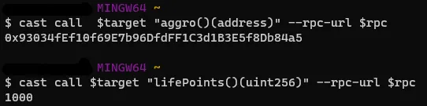

# Distract and Destroy

```
Sử dụng công cụ Foundry trên command line để tương tác blockchain.
```

Challenge này là challenge dễ nhất trong số các challenge blockchain Hack the Box. Để giải quyết mục tiêu challenge (`Creature`), số dư của contract phải bằng 0 — xem hàm `isSolved` của contract Setup. Trong bối cảnh challenge, phải `loot` `Creature`.

Hãy xem xét contract `Creature`. Để `loot`, biến trạng thái `lifePoints` phải bằng 0 và cách duy nhất để giảm nó là gọi hàm `attack`. Vì `lifePoints` ban đầu là 1000, cần thực hiện `attack` bằng cách truyền giá trị `damage` là 1000.

Bây giờ phân tích hàm `attack` của contract `Creature`. Đầu tiên, nó kiểm tra xem biến `aggro` có bằng 0 hay không. `Aggro` được sử dụng để lưu trữ giá trị địa chỉ và ban đầu nó bằng 0 do các biến mặc định. Sau đó, nó kiểm tra xem `tx.origin` có bằng `msg.sender` hay không (`_isOffBalance() function`). Nếu chúng bằng nhau, không thể giảm `lifePoints`. Ngoài ra, nó kiểm tra xem `aggro` có bằng `msg.sender` không. Và một lần nữa, chúng không nên bằng nhau.

```
Ở đây nên tập trung cụ thể vào sự khác biệt giữa tx.origin và msg.sender. Người gửi tin nhắn chỉ đơn giản là địa chỉ gọi một hàm cụ thể của contract. Đây có thể là địa chỉ EOA (tài khoản được kiểm soát bằng khóa riêng) hoặc địa chỉ contract. Mặt khác, nguồn gốc giao dịch là địa chỉ đã ký giao dịch, luôn là EOA. Ví dụ, giả sử gọi hàm attack trực tiếp thông qua EOA. Những gì làm là xây dựng một giao dịch với dữ liệu đầu vào, sau đó ký và gửi giao dịch. Trong trường hợp này, địa chỉ là tx.origin và cũng là msg.sender. Tuy nhiên, giả sử gọi phương thức hợp đồng khác (gọi là phương thức trung gian) ban đầu và hợp đồng đó gọi hàm attack của contract Creature, trong trường hợp này tx.origin sẽ là địa chỉ EOA và msg.sender sẽ là địa chỉ của người trung gian.
```

Vì lý do này, những gì phải làm trong trường hợp này là triển khai một contract trung gian và bỏ qua kiểm tra tính hợp lý này bằng cách gọi hàm attack thông qua trung gian. Ngoài ra, vì aggro chỉ thay đổi trong lần gọi đầu tiên, trước khi sử dụng trung gian trước, phải tấn công trực tiếp thông qua EOA.

Sau đây là các bước nên làm theo để solve (đừng quên thay thế các biến command line như target, private key, v.v.).

```
cast send $target "attack(uint256)" 1000 --private-key $private_key --rpc-url $rpc
```

Bằng cách chạy command trên, gửi một giao dịch gọi hàm attack của creature với giá trị 1000. Kết quả là, `aggro` thay đổi địa chỉ nhưng `lifePoints` không thay đổi vì hai lý do:

- `tx.origin` và `msg.sender` là giống nhau

- `aggro` tương đương với `msg.sender`



Có thể chạy các command trong hình ảnh trên để xem các biến trạng thái đã thay đổi như thế nào.

Những gì phải làm bây giờ là tạo một contract trung gian và deploy.

```
// SPDX-License-Identifier: UNLICENSED
pragma solidity ^0.8.13;

contract Middleman {
    address public target = 0x9ADAFC44200a10b29583438397B6A81A969E48cc;

    function attack(uint256 _damage) external {
        (bool success, bytes memory result) = target.call(abi.encodeWithSignature("attack(uint256)", _damage));
        require(success, string(result));
    }
}
```

Phía trên là contract sẽ sử dụng làm trung gian. Chỉ định target address trong hợp đồng, đừng quên thay thế nó. Contract này có một hàm có tên là attack và lấy giá trị damage làm đầu vào. Nó chỉ đơn giản là gọi hàm attack của mục tiêu. Theo cách này, người gửi tin nhắn sẽ là địa chỉ contract này và vượt qua nếu kiểm tra. Bây giờ hãy đặt tên tệp sol là `Middleman.sol` và đặt nó vào một thư mục có tên là `src`. Tiếp theo, triển khai bằng command bên dưới.

```
forge create src/Middleman.sol:Middleman --rpc-url $rpc --private-key $private_key --no-cache
```

Nếu deploy thành công, sẽ thấy address nơi deploy (`deploy to`). Việc tiếp theo phải làm là gọi hàm attack của trung gian. Có thể sử dụng command bên dưới.

```
cast send $middleman "attack(uint256)" 1000 --private-key $private_key --rpc-url $rpc
```

Bây giờ đã attack thành công target và `lifePoints` trở thành 0. Có thể kiểm tra lại bằng cách sử dụng các lệnh được hiển thị trong hình ảnh trên. Bước cuối cùng, phải loot và rút toàn bộ tiền trong contract. Sau đó sẽ có thể thấy flag. Sử dụng command bên dưới để thực hiện phương pháp loot.

```
cast send $target "loot()()" --rpc-url $rpc --private-key $private_key
```

Tóm lại, challenge này nhằm mục đích chứng minh rằng tx.origin không an toàn cho mục đích xác thực. Nói cách khác, không nên sử dụng nó để xác định người gọi. Nếu không, nó có thể dẫn đến lỗ hổng bảo mật và phising.