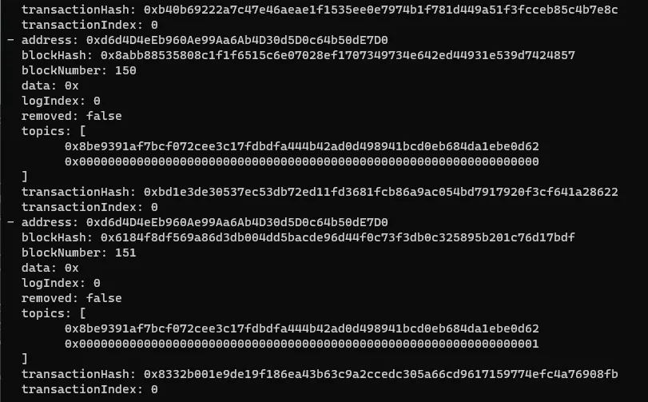

# Honor Among Thieves

```
Lưu ý: Sử dụng công cụ Foundry trên **command** line để tương tác blockchain.
```


Có hai contract solidity được cung cấp: `Setup.sol` và `Rivals.sol`. Nếu quen thuộc với các challenge blockchain Hack the Box, biết rằng `Setup` là contract thường khởi tạo và tạo ra các contract khác và các contract khác là các contract dễ bị tấn công cần khai thác. Chúng cũng được gọi là `Setup` và `Target`.

Setup contract bao gồm hàm `constructor` và hàm `isSolved`. `Constructor` tạo một `contract Rivals` mới bằng cách truyền hai tham số; `_encryptedFlag` và `_hashed`. `isSolved` kiểm tra xem address của solver có bằng với our address không.

Trong contract `Rivals`, có một hàm có tên là `talk()` lấy `key 32 byte` làm đầu vào. Trong hàm này, XOR operation được sử dụng cho mục đích giải mã. Nó XOR key và `encryptedFlag`, và tính toán hash của đầu ra. Sau đó so sánh với biến trạng thái `hashedFlag`. Nếu đúng, cập nhật địa chỉ solver và emit event với đối số `"5"`. Nếu không, emit `"block.timestamp % 5"`, là một số nhỏ hơn 5.

Cách duy nhất để trở thành solver là tìm đúng key. Vì đây là giá trị 256 bit nên không thể dùng brute-force. Ngoài ra, contract code không dễ bị tấn công bởi bất kỳ cuộc tấn công nào đã biết. Vì lý do này, cách khả thi để giải quyết challenge này là tận dụng tính minh bạch.

Trong code contract Rivals, address solver không được khởi tạo - biến address là 0x0 theo mặc định. Vì nó là công khai, có thể dễ dàng đọc giá trị của nó và xem nó có thay đổi không.

Lệnh sau trả về giá trị của biến trạng thái solver. Giả sử các biến bash như `RPC`, `TARGET`, v.v. đã được gán trước đó.

```
cast call $TARGET "solver()(address)" --rpc-url $RPC
```

Theo output của command trên, address solver không phải là 0x0. Nói cách khác, một tài khoản trước đó đã gọi hàm talk với key chính xác. Sau đó, những gì phải làm là tìm giao dịch đó và đọc input của nó để tìm key.

Để làm được điều đó thay vì đọc mọi giao dịch, chỉ cần xem event logs. Bởi vì khi hàm talk được thực thi, một event sẽ được emit. Nếu sử dụng đúng key, nó sẽ emit giá trị 5. Vì vậy chỉ cần lọc các giá trị log và tìm giao dịch có input key chính xác.

Sử dụng lệnh `cast logs` của Foundry để lấy tất cả các log bằng command sau:

```
cast logs --from-block 0 --to-block latest --rpc-url $RPC
```

Nó cho kết quả như bên dưới.



Hình ảnh trên là một phần của output của command cast logs. Nó hiển thị từng log với các trường liên quan. Các trường quan trọng là `topics` và `transactionHash`. Trong trường topics, có một mảng với hai giá trị. Giá trị đầu tiên là giá trị hash keccak256 của `"Voice(uint256)"` và giá trị thứ hai là giá trị số nguyên được ghi lại dưới dạng đối số event. Như trong hình ảnh, chúng lần lượt là 0 và 1. Để tìm sự kiện có đối số 5, cần chạy command sau.

```
cast logs --from-block 0 --to-block latest --rpc-url $RPC 0x8be9391af7bcf072cee3c17fdbdfa444b42ad0d498941bcd0eb684da1ebe0d62 0x0000000000000000000000000000000000000000000000000000000000000005
```

Trong lệnh này đã thêm giá trị topics vào cuối command để lọc.


Kết quả là đã tìm thấy event đang tìm kiếm và `transactionHash` cần.

Tiếp theo, kiểm tra dữ liệu giao dịch để tìm input bằng command `cast tx`.

```
cast tx 0x3f695ecd524fca7d23d4053113a1ca64d95c86e37ba03d45fa38e4ac1e084032 --rpc-url $RPC
```


Ở đây, thấy trường `input`. Nó bao gồm `signature function` và `parameter` của nó.

Những gì phải làm bây giờ là giải mã input và lấy key. Với mục đích này, sử dụng lệnh `cast calldata-decode`.

```
# input data - > 0x52eab0fa9b4a63e0bf32e7aab6789cf74f6013f6cfe6bcc719ad91f128cb902ea16d53ca

cast calldata-decode "talk(bytes32)" 0x52eab0fa9b4a63e0bf32e7aab6789cf74f6013f6cfe6bcc719ad91f128cb902ea16d53ca

# output of command (key) -> 0x9b4a63e0bf32e7aab6789cf74f6013f6cfe6bcc719ad91f128cb902ea16d53ca
```

Lệnh này giải mã input theo signature function và trả về các tham số được truyền cho command gọi hàm. Trong trường hợp này, nó trả về giá trị 32 byte sau, đây là key:

```
0x9b4a63e0bf32e7aab6789cf74f6013f6cfe6bcc719ad91f128cb902ea16d53ca
```

Sau đó, điều duy nhất cần làm là gửi một giao dịch gọi hàm talk với key chính xác và trở thành solver. Để làm điều đó, sử dụng lệnh `cast send`.

```
cast send $TARGET "talk(bytes32)" 9b4a63e0bf32e7aab6789cf74f6013f6cfe6bcc719ad91f128cb902ea16d53ca --private-key $PRIVATE_KEY--rpc-url $RPC

# Note that "0x" is omitted while sending key as input.
```

Theo cách đó, trở thành solver và có thể đạt được flag bằng cách điều hướng đến url `/flag`.

Do đó, challenge này nhấn mạnh thực tế rằng không có gì là bí mật. Bất kỳ dữ liệu biến trạng thái riêng tư hoặc input nào cũng có thể được tìm thấy bằng cách theo dõi chuỗi block và đọc giao dịch.