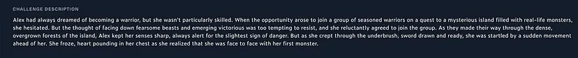
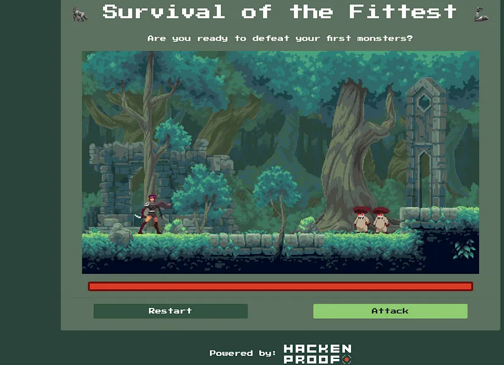
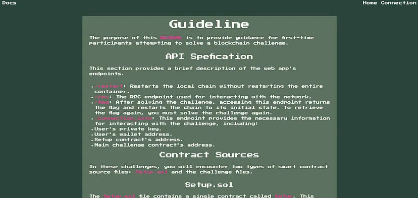
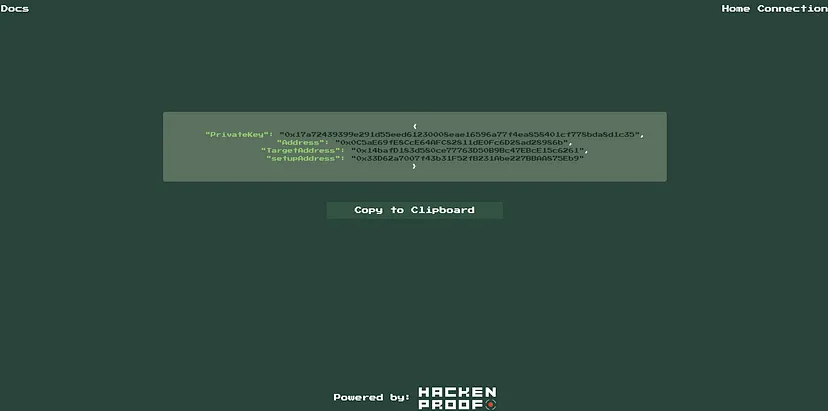
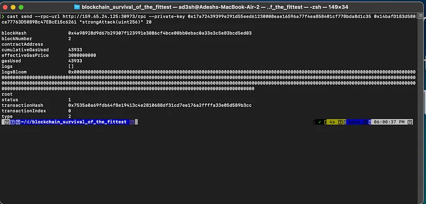

# Survival of the Fittest



## Code Review — Understanding Challenge

Có hai tệp Solidity, `Setup.sol` và `Creature.sol`, giống như các quy tắc của trò chơi.

- `Setup.sol` thiết lập challenge. Nó tạo ra một 'Creature' với 1 ether và mục tiêu là giảm số dư của nó xuống 0.

- `Creature.sol` mô tả sinh vật phải đánh bại. Nó có 20 điểm sinh lực và cần đưa những điểm này xuống 0 để giành chiến thắng.

Để giành được flag, phải đánh bại kẻ thù với điểm sinh lực là 20. Có 2 tùy chọn: `punch()` và `stringAttack(uint256 _damage)`.

```
// SPDX-License-Identifier: UNLICENSED
pragma solidity ^0.8.13;

contract Creature {
    
    uint256 public lifePoints;
    address public aggro;

    constructor() payable {
        lifePoints = 20;
    }

    function strongAttack(uint256 _damage) external{
        _dealDamage(_damage);
    }
    
    function punch() external {
        _dealDamage(1);
    }

    function loot() external {
        require(lifePoints == 0, "Creature is still alive!");
        payable(msg.sender).transfer(address(this).balance);
    }

    function _dealDamage(uint256 _damage) internal {
        aggro = msg.sender;
        lifePoints -= _damage;
    }
}
```

```
// SPDX-License-Identifier: UNLICENSED
pragma solidity ^0.8.13;

import {Creature} from "./Creature.sol";

contract Setup {
    Creature public immutable TARGET;

    constructor() payable {
        require(msg.value == 1 ether);
        TARGET = new Creature{value: 10}();
    }
    
    function isSolved() public view returns (bool) {
        return address(TARGET).balance == 0;
    }
}
```

## Lets meet the enemies here - (`http://IP:PORT/`)

Trang web cũng có hướng dẫn (tài liệu) giúp hiểu rõ hơn về challenge này.



Ở đây có thể xem Docs (`http://IP:PORT/docs`)



Cần kiểm tra `connections` để tìm địa chỉ `TargetAddress` cần thiết và khóa `PrivateKey` để giải quyết challenge này



## Engaging in the Battle

### Launching the Attack:

- Đầu tiên, sẽ sử dụng công cụ `cast` để tương tác với blockchain tại endpoint `/rpc`. Điều này giống như bắt đầu cuộc tấn công trong trận chiến kỹ thuật số.

https://book.getfoundry.sh/cast/

Thực hiện command:

```
cast send --rpc-url http://IP:PORT/rpc --private-key PRIVATE_KEY TARGET_ADDRESS "strongAttack(uint256)" 20
```

Hành động này sẽ tấn công mạnh vào sinh vật với giá trị sát thương là 20, nhằm mục đích làm cạn kiệt điểm sinh lực của nó chỉ trong một lần.



### Claiming Victory and Loot

Sau khi sinh vật bị đánh bại, đã đến lúc nhận phần thưởng.

Sử dụng command:

```
cast send --rpc-url http://IP:PORT/rpc --private-key PRIVATE_KEY TARGET_ADDRESS "loot()"
```

Điều này cho phép thu thập chiến lợi phẩm, tượng trưng cho sự thành công trong challenge.