# Forest

## Synopsis

Forest trong Windows Domain Controller (DC) có độ khó easy, dành cho một domain đã cài đặt Exchange Server. DC được phát hiện cho phép liên kết LDAP anonymous, được sử dụng để liệt kê các đối tượng domain. Mật khẩu cho tài khoản dịch vụ có pre-authen Kerberos disable có thể bị crack để có được foothold. Tài khoản dịch vụ được phát hiện là thành viên của group Account Operators, có thể được sử dụng để thêm người dùng vào các privilege Exchange group. Quyền thành viên group Exchange được tận dụng để có được đặc quyền DCSync trên domain và dump các hash NTLM.

### Skill Required

- Enumeration

### Skill Learned

- ASREPRoasting

- Enumeration sử dụng Bloodhound

- Tấn công DCSync

## Enumeration

### Nmap

```
ports=$(nmap -p- --min-rate=1000  -T4 10.10.10.161 | grep ^[0-9] | cut -d '/' -f 
1 | tr '\n' ',' | sed s/,$//)
nmap -sC -sV -p$ports 10.10.10.161
```

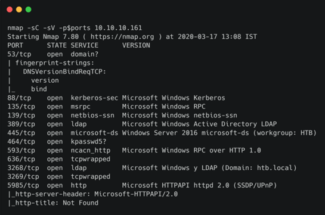

Machine này có vẻ như là Domain Controller cho domain `HTB.LOCAL`.

### LDAP

Kiểm tra xem dịch vụ LDAP có cho phép anonymous bind hay không bằng công cụ `ldapsearch`.

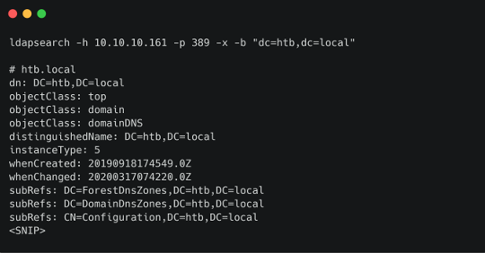

Cờ `-x` được sử dụng để chỉ định xác thực anonymous, trong khi cờ `-b` biểu thị basedn để bắt đầu. Có thể truy vấn domain mà không cần thông tin xác thực, nghĩa là null bind được bật.

Công cụ `windapsearch` có thể được sử dụng để truy vấn domain xa hơn.

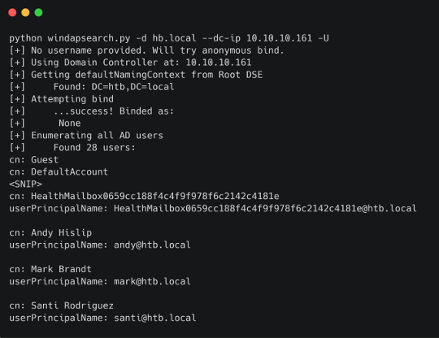

Cờ `-U` được sử dụng để enum tất cả user, tức là các đối tượng có `objectCategory` được đặt thành `user`. Tìm thấy một số tài khoản username và mailbox, điều này có nghĩa là exchange được cài đặt trong domain. Liệt kê tất cả các object khác trong domain bằng filter `objectClass=*`.

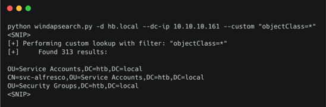

Query tìm thấy 313 object duy nhất, trong đó có một tài khoản dịch vụ có tên là `svc-alfresco`. Tìm kiếm `alfresco` online đưa đến tài liệu setup (https://docs.alfresco.com/process-services1.8/tasks/ps-auth-kerberos-ADconfig.html). Theo đó, dịch vụ cần phải vô hiệu hóa pre-authen Kerberos. Điều này có nghĩa là có thể request TGT được mã hóa cho người dùng này. Vì TGT chứa tài liệu được mã hóa bằng hàm hash NTLM của người dùng, có thể thực hiện tấn công brute force offline và cố gắng lấy mật khẩu cho `svc-alfresco`.

## Foothold

Có thể sử dụng script `GetNPUsers.py` từ Impacket để request ticket TGT và xuất mã hash.

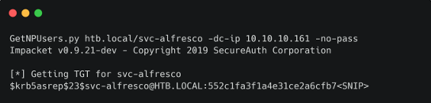

Sao chép mã hash vào một file và thử crack nó bằng JtR.

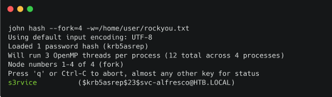

Mật khẩu cho tài khoản này được tiết lộ là `s3rvice`. Vì cổng 5985 cũng mở, có thể kiểm tra xem người dùng này có được phép đăng nhập từ xa qua WinRM bằng `Evil-WinRM` hay không.

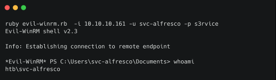

Quá trình này thành công và đã có thể thực thi lệnh trên máy chủ.

## Privilege Escalation

Sử dụng bloodhound để trực quan hóa domain và tìm kiếm các đường dẫn leo thang đặc quyền. Ingestor dựa trên python có thể được cài đặt bằng `pip install bloodhound`.

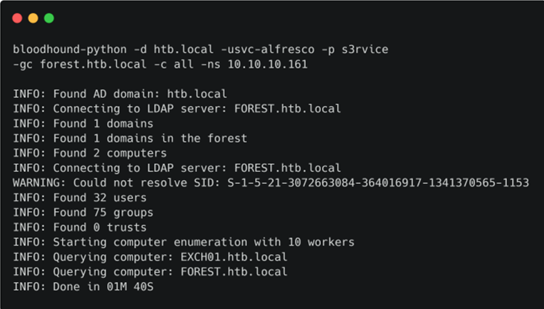

Sẽ có các tệp JSON được xuất ra trong thư mục, có thể được tải lên bloodhound GUI. Tìm kiếm người dùng `svc-alfresco` và đánh dấu là owned. Nhấp đúp vào nút sẽ hiển thị thuộc tính của nút đó ở bên phải. Đã tìm thấy `svc-alfresco` là thành viên của 9 group thông qua tư cách thành viên lồng nhau. Nhấp vào `9` để hiển thị biểu đồ thành viên.

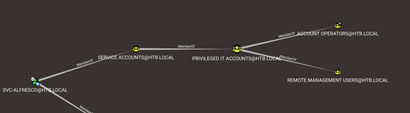

Một trong những group lồng nhau được tìm thấy là `Account Operators`, đây là group privilege AD. Theo documentation (https://docs.microsoft.com/en-us/windows/security/identity-protection/access-control/active-directory-security-groups#bkmk-accountoperators), các thành viên của group `Account Operators` được phép tạo và sửa đổi người dùng và thêm họ vào các group không được bảo vệ. Lưu ý điều này và xem các đường dẫn đến Domain Admins. Click vào `Queries` và chọn `Shortest Path to High Value targets`.

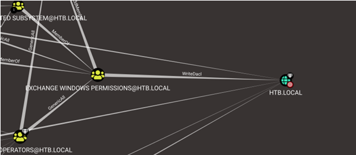

Một trong các đường dẫn cho thấy group `Exchange Windows Permissions` có đặc quyền `WriteDacl` trên Domain. Đặc quyền `WriteDACL` cấp cho người dùng khả năng thêm ACL vào một đối tượng. Điều này có nghĩa là có thể thêm người dùng vào group này và cấp cho họ đặc quyền `DCSync`.

Quay lại shell WinRM và thêm người dùng mới vào `Exchange Windows Permissions` cũng như group `Remote Management Users`.

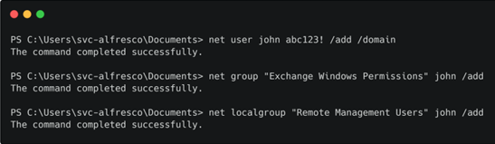

Các lệnh trên tạo một người dùng mới tên là `john` và thêm anh ta vào các group cần thiết. Tiếp theo, tải xuống script PowerView (https://github.com/PowerShellMafia/PowerSploit/blob/dev/Recon/PowerView.ps1) và import nó vào session hiện tại.

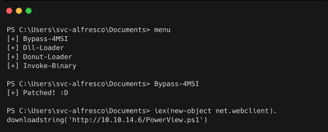

Lệnh `Bypass-4MSI` được sử dụng để tránh defender trước khi nhập script. Tiếp theo, có thể sử dụng `Add-ObjectACL` với thông tin xác thực của john và cấp cho anh ta quyền DCSync.

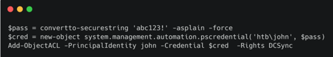

Script `secretsdump` từ Impacket hiện có thể run as john và được sử dụng để tiết lộ các hàm hash NTLM cho tất cả domain user.

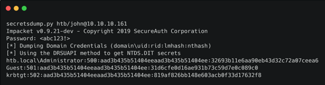

Hash Domain Admin thu được có thể được sử dụng để đăng nhập qua psexec.

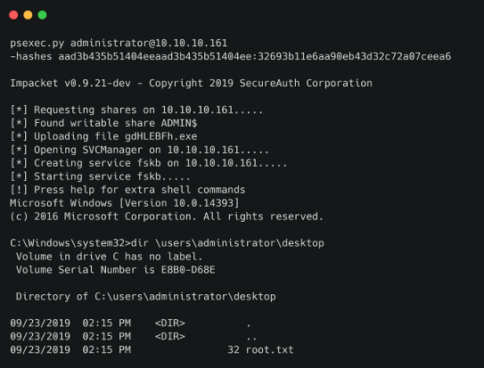