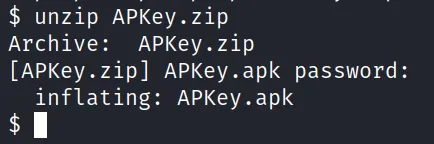

# APKey

Đầu tiên, tải apk từ trang web htb: https://app.hackthebox.com/challenges/APKey

File đã tải xuống sẽ là file .zip có thể giải nén bằng lệnh `unzip`. Nhập mật khẩu `hackthebox` để giải nén file zip.

Sau khi giải nén, có thể thấy file `APKey.apk`.

Có thể chạy file .apk trong `Genymotion` hoặc bất kỳ `emulator` hoặc `Android device` nào. Có thể thấy màn hình sau đây có nội dung `"Login to get a key."`. Khi cố gắng nhập tên người dùng và mật khẩu, nó sẽ hiển thị thông báo `"Wrong Credentials"` cần bypass.

Thử mở file .apk bằng ứng dụng `jadx-gui` để xem thông tin chi tiết về cách ứng dụng được build.

Chỉ cần mở file .apk như một file bình thường và nó sẽ cung cấp thông tin chi tiết về ứng dụng.

Trong số tất cả các thư mục được liệt kê, quan tâm đến thư mục `com/example/apkey`, có file `MainActivity`. Trong Android, `MainActivity` là file thông thường được `thực thi đầu tiên`.

Sau khi kiểm tra, có thể thấy tên người dùng là `"admin"` và mật khẩu là hàm băm md5 có kết quả là `"a2a3d412e92d896134d9c9126d756f"`. Có thể thấy `"Wrong Credentials"` củng cố thêm cho quá trình kiểm tra.

Do đó, có thể chỉ cần dùng brute force hash md5 và lấy mật khẩu và nhiệm vụ đã hoàn thành. Vì vậy, có thể sao chép hash và lưu trữ nó trong một file sau đó có thể dùng brute force để lấy mật khẩu. Đối với điều này, có thể sử dụng `john-the-ripper`.

Nhưng `john-the-ripper` không tìm ra password.

Vậy, bây giờ hãy thử thay đổi hash thành hash đã biết và wallah, có được flag. Bây giờ, `apktool` đến để giải cứu. Decompile file .apk, sử dụng command sau: `apktool d APKey.apk`

