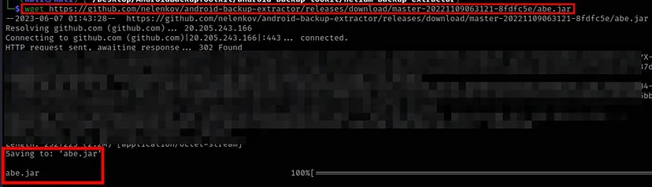
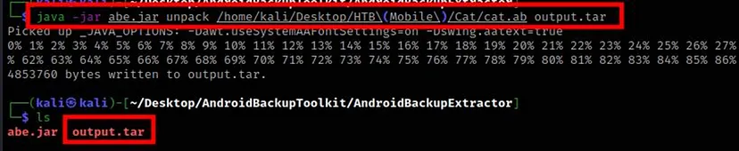
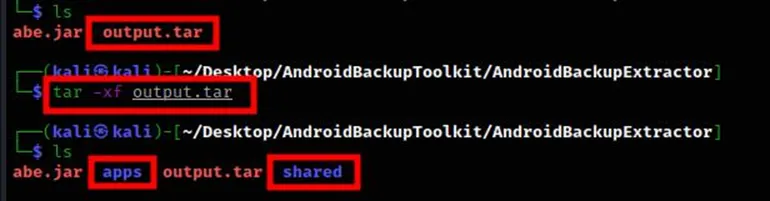
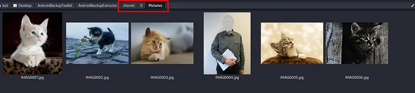
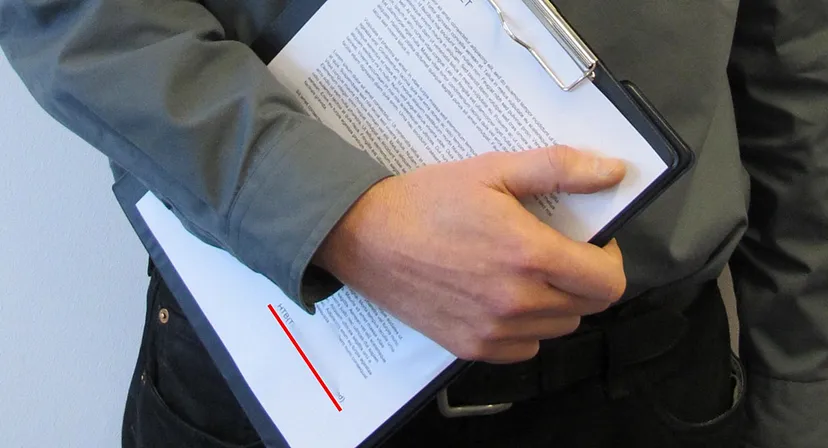

# Cat

"Cat" là một challenge dành cho mobile (android) từ HackTheBox, được phân loại là easy, nhấn mạnh tầm quan trọng của việc chú ý đến các chi tiết nhỏ khi thực hiện pentest trên bất kỳ thiết bị nào.

Đối với challenge này, required file được tải xuống Machine Kali Linux từ HackTheBox. File nén được giải nén và file đầu ra "cat.ab" có phần mở rộng ".ab" biểu thị rằng đó là file sao lưu Android. File sao lưu này phải được khôi phục để truy cập source code của ứng dụng cũng như nội dung/dữ liệu bên trong ứng dụng.

Để khôi phục file sao lưu (cat.ab), một công cụ có tên là android-backup-extractor cần được tải xuống hệ thống. Công cụ này cũng có thể được tải xuống hệ thống trong thư mục làm việc hiện tại bằng cách sử dụng lệnh: `wget https://github.com/nelenkov/android-backup-extractor/releases/download/master-20221109063121-8fdfc5e/abe.jar`.

File abe.jar sẽ có trong thư mục nơi lệnh wget được thực thi.

Lệnh sau được chạy từ thư mục chứa file abe.jar để giải nén file "cat.ab": `java -jar abe.jar unpack /<directory_path_of_cat.ab_file>/cat.ab <name_of_output_file>.tar`

Sau đó, file output.tar được giải nén bằng lệnh: `tar -xf <name_of_output_file>.tar` và thu được hai file "apps" và "shared".

Cả hai file đều được phân tích và không tìm thấy nội dung nào đáng quan tâm bên trong thư mục "apps", nhưng trong thư mục "shared", có một thư mục có tên "Pictures" chứa nhiều hình ảnh trong khi các thư mục còn lại đều trống.

Trong số các hình ảnh có một hình ảnh "IMAG0004.jpg", nổi bật. Khi phân tích hình ảnh này, có thể thấy flag ẩn bên trong hình ảnh.

Khi nộp flag cho challenge HTB, challenge được hoàn thành