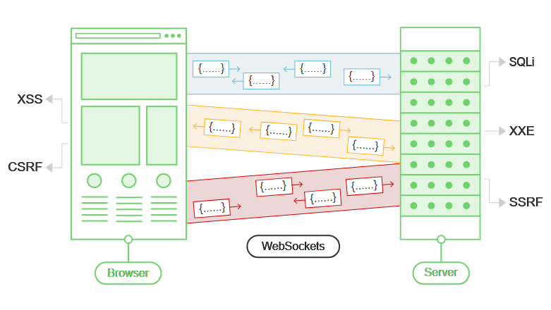

# WebSockets vulnerabilities

## WebSockets

WebSockets được sử dụng rộng rãi trong các ứng dụng web hiện đại. Chúng được khởi tạo qua HTTP và cung cấp các kết nối lâu dài với giao tiếp không đồng bộ theo cả hai hướng.

WebSockets được sử dụng cho mọi mục đích, bao gồm thực hiện các hành động của người dùng và truyền thông tin nhạy cảm. Hầu như bất kỳ lỗ hổng bảo mật web nào phát sinh với HTTP thông thường cũng có thể phát sinh liên quan đến giao tiếp WebSockets.



## Manipulating WebSocket traffic

Việc tìm lỗ hổng bảo mật WebSockets thường liên quan đến việc thao túng chúng theo những cách mà ứng dụng không ngờ tới. Có thể thực hiện việc này bằng Burp Suite.

Có thể sử dụng Burp Suite để:

- Chặn và sửa đổi tin nhắn WebSocket.

- Phát lại và tạo tin nhắn WebSocket mới.

- Thao túng các kết nối WebSocket.

### Intercepting and modifying WebSocket messages

Có thể sử dụng Burp Proxy để chặn và sửa đổi tin nhắn WebSocket như sau:

- Mở trình duyệt Burp.

- Duyệt đến chức năng ứng dụng sử dụng WebSockets. Có thể xác định WebSockets đang được sử dụng bằng cách sử dụng ứng dụng và tìm kiếm các mục xuất hiện trong tab WebSockets history trong Burp Proxy.

- Trong tab Intercept của Burp Proxy, đảm bảo rằng tính năng interception được bật.

- Khi tin nhắn WebSocket được gửi từ trình duyệt hoặc máy chủ, tin nhắn đó sẽ được hiển thị trong tab Intercept để xem hoặc sửa đổi. Nhấn nút Foward để chuyển tiếp message.

```
Lưu ý: Có thể cấu hình xem message client-to-server hay server-to-client có bị intercept trong Burp Proxy hay không. Thực hiện việc này trong Setting dialog, trong WebSocket interception rules settings.
```

### Replaying and generating new WebSocket messages

Ngoài việc chặn và sửa đổi tin nhắn WebSocket khi đang di chuyển, có thể phát lại từng tin nhắn và tạo tin nhắn mới. Có thể thực hiện việc này bằng Burp Repeater:

- Trong Burp Proxy, chọn một tin nhắn trong lịch sử WebSockets hoặc trong tab Intercept và chọn "Send to Repeater".

- Trong Burp Repeater, giờ đây có thể chỉnh sửa tin nhắn đã chọn và gửi đi gửi lại.

- Có thể nhập tin nhắn mới và gửi theo bất kỳ hướng nào, đến máy khách hoặc máy chủ.

- Trong bảng "History" trong Burp Repeater, có thể xem lịch sử các tin nhắn đã được truyền qua kết nối WebSocket. Điều này bao gồm các tin nhắn đã tạo trong Burp Repeater và bất kỳ tin nhắn nào được trình duyệt hoặc máy chủ tạo ra thông qua cùng một kết nối.

- Nếu muốn chỉnh sửa và gửi lại bất kỳ tin nhắn nào trong history panel, có thể thực hiện việc này bằng cách chọn tin nhắn và chọn "Edit and resend".

### Manipulating WebSocket connections

Cũng như thao tác các message WebSocket, đôi khi cần phải thao tác handshake WebSocket thiết lập kết nối.

Có nhiều tình huống khác nhau mà việc thao tác handshake WebSocket có thể cần thiết:

- Nó có thể cho phép tiếp cận nhiều bề mặt tấn công hơn.

- Một số cuộc tấn công có thể khiến kết nối bị ngắt nên cần thiết lập kết nối mới.

- Token hoặc dữ liệu khác trong yêu cầu handshake ban đầu có thể đã cũ và cần cập nhật.

Có thể thao tác handshake WebSocket bằng Burp Repeater:

- Gửi message WebSocket đến Burp Repeater như đã mô tả.

- Trong Burp Repeater, click vào biểu tượng pencil bên cạnh URL WebSocket. Thao tác này sẽ mở trình hướng dẫn cho phép đính kèm vào WebSocket đã kết nối hiện có, sao chép WebSocket đã kết nối hoặc kết nối lại với WebSocket đã ngắt kết nối.

- Nếu chọn sao chép WebSocket đã kết nối hoặc kết nối lại với WebSocket đã ngắt kết nối, trình hướng dẫn sẽ hiển thị đầy đủ thông tin chi tiết về yêu cầu handshake WebSocket, có thể chỉnh sửa theo request trước khi thực hiện handshake.

- Khi click vào "Connect", Burp sẽ cố gắng thực hiện handshake đã định cấu hình và hiển thị kết quả. Nếu kết nối WebSocket mới được thiết lập thành công, sau đó có thể sử dụng điều này để gửi message mới trong Burp Repeater.

## WebSockets security vulnerabilities

Về nguyên tắc, hầu như bất kỳ lỗ hổng bảo mật web nào cũng có thể phát sinh liên quan đến WebSockets:

- Đầu vào do người dùng cung cấp được truyền đến máy chủ có thể được xử lý theo những cách không an toàn, dẫn đến các lỗ hổng như SQL injection hoặc XML external entity injection.

- Một số lỗ hổng ẩn đạt được thông qua WebSockets chỉ có thể phát hiện được bằng các kỹ thuật out-of-band (OAST).

- Nếu dữ liệu do kẻ tấn công kiểm soát được truyền qua WebSockets đến những người dùng ứng dụng khác, thì có thể dẫn đến XSS hoặc các lỗ hổng khác ở phía máy khách.

## Manipulating WebSocket messages to exploit vulnerabilities

Phần lớn các lỗ hổng dựa trên input ảnh hưởng đến WebSockets có thể được tìm thấy và khai thác bằng cách can thiệp vào nội dung của message WebSocket.

Ví dụ, giả sử một ứng dụng trò chuyện sử dụng WebSockets để gửi tin nhắn trò chuyện giữa trình duyệt và máy chủ. Khi người dùng nhập tin nhắn trò chuyện, tin nhắn WebSocket như sau sẽ được gửi đến máy chủ:

```
{"message":"Hello Carlos"}
```

Nội dung của tin nhắn được truyền (một lần nữa qua WebSockets) đến một người dùng trò chuyện khác và được hiển thị trong trình duyệt của người dùng như sau:

```
<td>Hello Carlos</td>
```

Trong tình huống này, nếu không có bất kỳ xử lý đầu vào hoặc biện pháp phòng thủ nào khác đang được triển khai, kẻ tấn công có thể thực hiện một cuộc tấn công XSS bằng chứng khái niệm bằng cách gửi tin nhắn WebSocket sau:

```
{"message":""}
```

### Lab: Manipulating WebSocket messages to exploit vulnerabilities

Online shop này có tính năng trò chuyện trực tiếp được triển khai bằng WebSockets.

Tin nhắn trò chuyện được gửi sẽ được nhân viên hỗ trợ xem theo thời gian thực.

Để solve lab, sử dụng tin nhắn WebSocket để kích hoạt cửa sổ bật lên `alert()` trong browser của nhân viên hỗ trợ.

#### Solution

1. Click vào "Live chat" và gửi tin nhắn trò chuyện.

2. Trong Burp Proxy, chuyển đến tab WebSockets history và quan sát rằng tin nhắn trò chuyện đã được gửi qua tin nhắn WebSocket.

3. Sử dụng browser, gửi tin nhắn mới có chứa ký tự <.

4. Trong Burp Proxy, tìm tin nhắn WebSocket tương ứng và quan sát rằng < đã được mã hóa HTML bởi máy khách trước khi gửi.

5. Đảm bảo rằng Burp Proxy được cấu hình để intercept tin nhắn WebSocket, sau đó gửi một tin nhắn trò chuyện khác.

6. Chỉnh sửa tin nhắn đã intercept chứa nội dung sau:

    ```
    
    ```

7. Lưu ý rằng alert sẽ được kích hoạt trong browser. Điều này cũng sẽ xảy ra trong trình duyệt của nhân viên hỗ trợ.

## Manipulating the WebSocket handshake to exploit vulnerabilities

Một số lỗ hổng WebSockets chỉ có thể được tìm thấy và khai thác bằng cách thao túng handshake WebSocket. Các lỗ hổng này có xu hướng liên quan đến các lỗi thiết kế, chẳng hạn như:

- Tin tưởng sai chỗ vào tiêu đề HTTP để thực hiện các quyết định bảo mật, chẳng hạn như tiêu đề X-Forwarded-For.

- Các lỗi trong cơ chế xử lý phiên, vì ngữ cảnh phiên mà các thông báo WebSocket được xử lý thường được xác định bởi ngữ cảnh phiên của thông báo handshake.

- Bề mặt tấn công được giới thiệu bởi các tiêu đề HTTP tùy chỉnh được ứng dụng sử dụng.

### Lab: Manipulating the WebSocket handshake to exploit vulnerabilities

Online shop này có tính năng trò chuyện trực tiếp được triển khai bằng WebSockets.

Nó có bộ lọc XSS mạnh mẽ nhưng có lỗi.

Để solve lab, sử dụng tin nhắn WebSocket để kích hoạt bật lên `alert()` trong trình duyệt của nhân viên hỗ trợ.

#### Hint

- Đôi khi có thể vượt qua các hạn chế dựa trên IP bằng cách sử dụng tiêu đề HTTP như `X-Forwarded-For`.

#### Solution

1. Nhấp vào "Live chat" và gửi tin nhắn trò chuyện.

2. Trong Burp Proxy, hãy chuyển đến tab WebSockets history và quan sát rằng tin nhắn trò chuyện đã được gửi qua tin nhắn WebSocket.

3. Nhấp chuột phải vào tin nhắn và chọn "Send to Repeater".

4. Chỉnh sửa và gửi lại tin nhắn có chứa payload XSS cơ bản, chẳng hạn như:

    ```
    
    ```

5. Lưu ý rằng cuộc tấn công đã bị chặn và kết nối WebSocket đã bị chấm dứt.

6. Nhấp vào "Reconnect" và lưu ý rằng nỗ lực kết nối không thành công vì địa chỉ IP đã bị cấm.

7. Thêm tiêu đề sau vào yêu cầu handshake để giả mạo địa chỉ IP:

    ```
    X-Forwarded-For: 1.1.1.1
    ```

8. Nhấp vào "Connect" để kết nối lại WebSocket thành công.

9. Gửi tin nhắn WebSocket có chứa payload XSS được obfuscate, chẳng hạn như:

    ```
    
    ```

## Using cross-site WebSockets to exploit vulnerabilities

Một số lỗ hổng bảo mật WebSockets phát sinh khi kẻ tấn công tạo kết nối WebSocket cross-domain từ một trang web mà kẻ tấn công kiểm soát. Đây được gọi là cuộc tấn công chiếm quyền điều khiển cross-site WebSocket và liên quan đến việc khai thác lỗ hổng cross-site request forgery (CSRF) trên handshake WebSocket. Cuộc tấn công thường có tác động nghiêm trọng, cho phép kẻ tấn công thực hiện các hành động đặc quyền thay mặt cho người dùng nạn nhân hoặc thu thập dữ liệu nhạy cảm mà người dùng nạn nhân có quyền truy cập.

### What-is cross-site WebSocket hijacking?

Tấn công cross-site WebSocket (còn được gọi là tấn công cross-origin WebSocket) liên quan đến lỗ hổng cross-site request forgery (CSRF) trên handshake WebSocket. Nó phát sinh khi yêu cầu handshake WebSocket chỉ dựa vào cookie HTTP để xử lý phiên và không chứa bất kỳ CSRF token hoặc các giá trị không thể đoán trước nào khác.

Kẻ tấn công có thể tạo một trang web độc hại trên tên miền của riêng chúng, thiết lập kết nối cross-site WebSocket với ứng dụng dễ bị tấn công. Ứng dụng sẽ xử lý kết nối trong bối cảnh phiên của người dùng nạn nhân với ứng dụng.

Sau đó, trang của kẻ tấn công có thể gửi các tin nhắn tùy ý đến máy chủ thông qua kết nối và đọc nội dung của các tin nhắn được nhận lại từ máy chủ. Điều này có nghĩa là, không giống như CSRF thông thường, kẻ tấn công có được tương tác hai chiều với ứng dụng bị xâm phạm.

### What is the impact of cross-site WebSocket hijacking?

Một cuộc tấn công chiếm đoạt cross-site WebSocket thành công thường sẽ cho phép kẻ tấn công:

- `Thực hiện các hành động trái phép ngụy trang thành người dùng nạn nhân`. Cũng giống như CSRF thông thường, kẻ tấn công có thể gửi các thông điệp tùy ý đến ứng dụng phía máy chủ. Nếu ứng dụng sử dụng các thông điệp WebSocket do máy khách tạo để thực hiện bất kỳ hành động nhạy cảm nào, thì kẻ tấn công có thể tạo các thông điệp phù hợp trên nhiều miền và kích hoạt các hành động đó.

- `Truy xuất dữ liệu nhạy cảm mà người dùng có thể truy cập`. Không giống như CSRF thông thường, chiếm đoạt WebSocket chéo trang cung cấp cho kẻ tấn công tương tác hai chiều với ứng dụng dễ bị tấn công qua WebSocket bị chiếm đoạt. Nếu ứng dụng sử dụng các thông điệp WebSocket do máy chủ tạo để trả về bất kỳ dữ liệu nhạy cảm nào cho người dùng, thì kẻ tấn công có thể chặn các thông điệp đó và thu thập dữ liệu của người dùng nạn nhân.

### Performing a cross-site WebSocket hijacking attack

Vì một cuộc tấn công chiếm quyền điều khiển cross-site WebSocket về cơ bản là lỗ hổng CSRF trên handshake WebSocket, nên bước đầu tiên để thực hiện một cuộc tấn công là xem xét các handshake WebSocket mà ứng dụng thực hiện và xác định xem chúng có được bảo vệ chống lại CSRF hay không.

Về các điều kiện thông thường cho các cuộc tấn công CSRF, thường cần tìm một thông báo handshake chỉ dựa vào cookie HTTP để xử lý phiên và không sử dụng bất kỳ token hoặc giá trị không thể đoán trước nào khác trong các tham số request.

Ví dụ: yêu cầu handshake WebSocket sau đây có thể dễ bị tấn công CSRF vì token phiên duy nhất được truyền qua cookie:

```
GET /chat HTTP/1.1
Host: normal-website.com
Sec-WebSocket-Version: 13
Sec-WebSocket-Key: wDqumtseNBJdhkihL6PW7w==
Connection: keep-alive, Upgrade
Cookie: session=KOsEJNuflw4Rd9BDNrVmvwBF9rEijeE2
Upgrade: websocket
```

```
Lưu ý: Header Sec-WebSocket-Key chứa một giá trị ngẫu nhiên để ngăn ngừa lỗi từ cache proxy và không được sử dụng cho mục đích xác thực hoặc xử lý phiên.
```

Nếu request handshake WebSocket dễ bị CSRF, thì trang web của kẻ tấn công có thể thực hiện yêu cầu liên trang web để mở WebSocket trên trang web dễ bị tấn công. Những gì xảy ra tiếp theo trong cuộc tấn công hoàn toàn phụ thuộc vào logic của ứng dụng và cách ứng dụng sử dụng WebSockets. Cuộc tấn công có thể bao gồm:

- Gửi tin nhắn WebSocket để thực hiện các hành động trái phép thay mặt cho người dùng nạn nhân.

- Gửi tin nhắn WebSocket để truy xuất dữ liệu nhạy cảm.

- Đôi khi, chỉ cần chờ tin nhắn đến có chứa dữ liệu nhạy cảm.